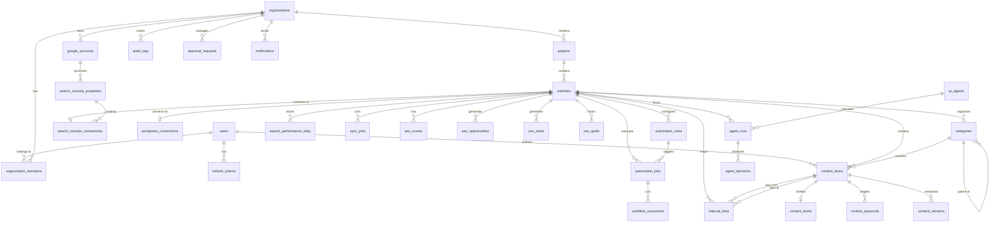

# Database Design — AI SEO OS

## Design Conventions

- **Primary keys**: UUID v4 on all tables
- **Timestamps**: `created_at` and `updated_at` (TIMESTAMPTZ, auto-set) on all tables
- **Soft delete**: `deleted_at` (TIMESTAMPTZ, nullable) on business entities
- **Organization scoping**: `organization_id` FK on every org-level entity
- **Naming**: snake_case for tables and columns
- **Enums**: Stored as VARCHAR with application-level validation (avoids migration pain of PostgreSQL enums)
- **JSONB**: Used for flexible metadata, agent outputs, and configuration — never for data that needs indexing or relational queries
- **Indexes**: On all foreign keys, all filter/sort columns, and composite unique constraints for deduplication

---

## Entity Relationship Diagram

---

## Table Definitions

### Phase 1 — Foundation (7 tables)

---

#### `users`

| Column | Type | Constraints | Description |
|---|---|---|---|
| `id` | UUID | PK, DEFAULT gen_random_uuid() | |
| `email` | VARCHAR(255) | UNIQUE, NOT NULL | Login email |
| `password_hash` | VARCHAR(255) | NOT NULL | bcrypt hash |
| `full_name` | VARCHAR(255) | NOT NULL | Display name |
| `avatar_url` | TEXT | | Profile image URL |
| `is_active` | BOOLEAN | DEFAULT true | Account active flag |
| `email_verified_at` | TIMESTAMPTZ | | When email was verified |
| `last_login_at` | TIMESTAMPTZ | | Last successful login |
| `preferences` | JSONB | DEFAULT '{}' | UI preferences, language, timezone |
| `created_at` | TIMESTAMPTZ | DEFAULT NOW(), NOT NULL | |
| `updated_at` | TIMESTAMPTZ | DEFAULT NOW(), NOT NULL | |
| `deleted_at` | TIMESTAMPTZ | | Soft delete |

**Indexes**: `idx_users_email` UNIQUE on `email`

---

#### `organizations`

| Column | Type | Constraints | Description |
|---|---|---|---|
| `id` | UUID | PK | |
| `name` | VARCHAR(255) | NOT NULL | Organization name |
| `slug` | VARCHAR(255) | UNIQUE, NOT NULL | URL-safe identifier |
| `logo_url` | TEXT | | Organization logo |
| `plan` | VARCHAR(50) | DEFAULT 'free' | Subscription plan |
| `settings` | JSONB | DEFAULT '{}' | Global org settings |
| `created_at` | TIMESTAMPTZ | DEFAULT NOW(), NOT NULL | |
| `updated_at` | TIMESTAMPTZ | DEFAULT NOW(), NOT NULL | |
| `deleted_at` | TIMESTAMPTZ | | |

**Indexes**: `idx_organizations_slug` UNIQUE on `slug`

---

#### `organization_members`

| Column | Type | Constraints | Description |
|---|---|---|---|
| `id` | UUID | PK | |
| `organization_id` | UUID | FK → organizations.id, NOT NULL | |
| `user_id` | UUID | FK → users.id, NOT NULL | |
| `role` | VARCHAR(50) | NOT NULL | owner, admin, seo_manager, editor, reviewer, viewer |
| `invited_by` | UUID | FK → users.id | Who sent the invite |
| `invited_at` | TIMESTAMPTZ | | When invitation was sent |
| `joined_at` | TIMESTAMPTZ | | When user accepted |
| `created_at` | TIMESTAMPTZ | DEFAULT NOW(), NOT NULL | |
| `updated_at` | TIMESTAMPTZ | DEFAULT NOW(), NOT NULL | |

**Indexes**: `uq_org_members_org_user` UNIQUE on `(organization_id, user_id)`

---

#### `projects`

| Column | Type | Constraints | Description |
|---|---|---|---|
| `id` | UUID | PK | |
| `organization_id` | UUID | FK → organizations.id, NOT NULL | |
| `name` | VARCHAR(255) | NOT NULL | Project name |
| `slug` | VARCHAR(255) | NOT NULL | URL-safe within org |
| `description` | TEXT | | |
| `created_at` | TIMESTAMPTZ | DEFAULT NOW(), NOT NULL | |
| `updated_at` | TIMESTAMPTZ | DEFAULT NOW(), NOT NULL | |
| `deleted_at` | TIMESTAMPTZ | | |

**Indexes**: `uq_projects_org_slug` UNIQUE on `(organization_id, slug)`, `idx_projects_org_id` on `organization_id`

---

#### `websites`

| Column | Type | Constraints | Description |
|---|---|---|---|
| `id` | UUID | PK | |
| `project_id` | UUID | FK → projects.id, NOT NULL | |
| `organization_id` | UUID | FK → organizations.id, NOT NULL | Denormalized for query efficiency |
| `name` | VARCHAR(255) | NOT NULL | Display name |
| `domain` | VARCHAR(255) | NOT NULL | e.g. example.com |
| `base_url` | VARCHAR(500) | NOT NULL | e.g. https://example.com |
| `website_type` | VARCHAR(50) | DEFAULT 'blog' | blog, ecommerce, corporate, news, affiliate, custom |
| `language` | VARCHAR(10) | DEFAULT 'fa' | Primary content language |
| `country` | VARCHAR(5) | DEFAULT 'IR' | Target country |
| `timezone` | VARCHAR(50) | DEFAULT 'Asia/Tehran' | |
| `automation_mode` | VARCHAR(20) | DEFAULT 'manual' | manual, ai_assist, autopilot |
| `status` | VARCHAR(20) | DEFAULT 'active' | active, paused, archived |
| `seo_goals` | JSONB | DEFAULT '{}' | Target metrics |
| `content_production_limit` | INT | DEFAULT 10 | Max articles per week |
| `notification_preferences` | JSONB | DEFAULT '{}' | Channel preferences |
| `created_at` | TIMESTAMPTZ | DEFAULT NOW(), NOT NULL | |
| `updated_at` | TIMESTAMPTZ | DEFAULT NOW(), NOT NULL | |
| `deleted_at` | TIMESTAMPTZ | | |

**Indexes**: `idx_websites_project_id` on `project_id`, `idx_websites_org_id` on `organization_id`, `idx_websites_domain` on `domain`

---

#### `refresh_tokens`

| Column | Type | Constraints | Description |
|---|---|---|---|
| `id` | UUID | PK | |
| `user_id` | UUID | FK → users.id, NOT NULL | |
| `token_hash` | VARCHAR(255) | NOT NULL | SHA-256 hash of token |
| `device_info` | TEXT | | User agent / device |
| `ip_address` | INET | | Login IP |
| `expires_at` | TIMESTAMPTZ | NOT NULL | |
| `revoked_at` | TIMESTAMPTZ | | If manually revoked |
| `created_at` | TIMESTAMPTZ | DEFAULT NOW(), NOT NULL | |

**Indexes**: `idx_refresh_tokens_user_id` on `user_id`, `idx_refresh_tokens_hash` on `token_hash`

---

#### `audit_logs`

| Column | Type | Constraints | Description |
|---|---|---|---|
| `id` | UUID | PK | |
| `organization_id` | UUID | FK → organizations.id | |
| `user_id` | UUID | FK → users.id | Human actor |
| `agent_id` | UUID | | AI agent actor |
| `action` | VARCHAR(100) | NOT NULL | e.g. website.created, content.published |
| `entity_type` | VARCHAR(100) | | e.g. website, content_item |
| `entity_id` | UUID | | ID of affected entity |
| `before_state` | JSONB | | Snapshot before change |
| `after_state` | JSONB | | Snapshot after change |
| `metadata` | JSONB | | Additional context |
| `ip_address` | INET | | Request IP |
| `created_at` | TIMESTAMPTZ | DEFAULT NOW(), NOT NULL | |

**Indexes**: `idx_audit_org_id` on `organization_id`, `idx_audit_entity` on `(entity_type, entity_id)`, `idx_audit_created_at` on `created_at`, `idx_audit_action` on `action`

No `updated_at` or `deleted_at` — audit logs are immutable.

---

### Phase 2 — Search Console (5 tables)

---

#### `google_accounts`

| Column | Type | Constraints | Description |
|---|---|---|---|
| `id` | UUID | PK | |
| `organization_id` | UUID | FK → organizations.id, NOT NULL | |
| `user_id` | UUID | FK → users.id, NOT NULL | Who connected the account |
| `google_email` | VARCHAR(255) | NOT NULL | Google account email |
| `google_id` | VARCHAR(255) | | Google user ID |
| `access_token_enc` | TEXT | NOT NULL | Fernet-encrypted access token |
| `refresh_token_enc` | TEXT | NOT NULL | Fernet-encrypted refresh token |
| `token_expires_at` | TIMESTAMPTZ | | Access token expiry |
| `scopes` | TEXT[] | | Granted OAuth scopes |
| `status` | VARCHAR(20) | DEFAULT 'active' | active, expired, revoked |
| `created_at` | TIMESTAMPTZ | DEFAULT NOW(), NOT NULL | |
| `updated_at` | TIMESTAMPTZ | DEFAULT NOW(), NOT NULL | |

**Indexes**: `idx_google_accounts_org_id` on `organization_id`, `uq_google_accounts_org_email` UNIQUE on `(organization_id, google_email)`

---

#### `search_console_properties`

| Column | Type | Constraints | Description |
|---|---|---|---|
| `id` | UUID | PK | |
| `google_account_id` | UUID | FK → google_accounts.id, NOT NULL | |
| `property_url` | VARCHAR(500) | NOT NULL | e.g. sc-domain:example.com |
| `property_type` | VARCHAR(20) | | domain, url_prefix |
| `permission_level` | VARCHAR(20) | | siteOwner, siteFullUser, siteRestrictedUser, siteUnverifiedUser |
| `created_at` | TIMESTAMPTZ | DEFAULT NOW(), NOT NULL | |

**Indexes**: `idx_sc_properties_account` on `google_account_id`

---

#### `search_console_connections`

| Column | Type | Constraints | Description |
|---|---|---|---|
| `id` | UUID | PK | |
| `website_id` | UUID | FK → websites.id, UNIQUE, NOT NULL | One connection per website |
| `property_id` | UUID | FK → search_console_properties.id, NOT NULL | |
| `sync_enabled` | BOOLEAN | DEFAULT true | |
| `sync_interval_hours` | INT | DEFAULT 24 | |
| `last_sync_at` | TIMESTAMPTZ | | |
| `last_sync_status` | VARCHAR(20) | | success, failed, partial |
| `last_sync_error` | TEXT | | Error message if failed |
| `data_start_date` | DATE | | Earliest date with data |
| `created_at` | TIMESTAMPTZ | DEFAULT NOW(), NOT NULL | |
| `updated_at` | TIMESTAMPTZ | DEFAULT NOW(), NOT NULL | |

**Indexes**: `uq_sc_connections_website` UNIQUE on `website_id`

---

#### `search_performance_daily`

This is the main fact table. Stores one row per unique combination of website + date + query + page + country + device + search_type.

| Column | Type | Constraints | Description |
|---|---|---|---|
| `id` | UUID | PK | |
| `website_id` | UUID | FK → websites.id, NOT NULL | |
| `date` | DATE | NOT NULL | Performance date |
| `query` | TEXT | | Search query (NULL = aggregated) |
| `page` | TEXT | | Landing page URL (NULL = aggregated) |
| `country` | VARCHAR(10) | | ISO country code |
| `device` | VARCHAR(20) | | DESKTOP, MOBILE, TABLET |
| `search_type` | VARCHAR(20) | DEFAULT 'web' | web, image, video, news, discover, googleNews |
| `clicks` | INT | DEFAULT 0, NOT NULL | |
| `impressions` | INT | DEFAULT 0, NOT NULL | |
| `ctr` | DOUBLE PRECISION | DEFAULT 0, NOT NULL | 0.0 – 1.0 |
| `position` | DOUBLE PRECISION | DEFAULT 0, NOT NULL | Average position |
| `created_at` | TIMESTAMPTZ | DEFAULT NOW(), NOT NULL | |

**Indexes**:
- `uq_search_perf_daily` UNIQUE on `(website_id, date, query, page, country, device, search_type)` — deduplication
- `idx_search_perf_website_date` on `(website_id, date)` — date range queries
- `idx_search_perf_query` on `(website_id, query)` — query explorer
- `idx_search_perf_page` on `(website_id, page)` — page explorer
- `idx_search_perf_date` on `date` — global date scans

**Note on NULLs in unique constraint**: PostgreSQL treats NULLs as distinct in unique constraints. For deduplication, the sync worker must use `COALESCE(query, '')` or use `ON CONFLICT` with a partial index.

**Partitioning (future)**: When the table exceeds ~50M rows, partition by `date` (monthly range partitions).

---

#### `sync_jobs`

| Column | Type | Constraints | Description |
|---|---|---|---|
| `id` | UUID | PK | |
| `website_id` | UUID | FK → websites.id, NOT NULL | |
| `job_type` | VARCHAR(50) | NOT NULL | search_console_sync, wordpress_sync, full_analysis |
| `status` | VARCHAR(20) | DEFAULT 'pending' | pending, running, completed, failed, cancelled |
| `date_from` | DATE | | Start of date range |
| `date_to` | DATE | | End of date range |
| `records_fetched` | INT | | Rows received from API |
| `records_stored` | INT | | Rows written to DB |
| `error_message` | TEXT | | Error details if failed |
| `retry_count` | INT | DEFAULT 0 | |
| `idempotency_key` | VARCHAR(255) | UNIQUE | Prevents duplicate job runs |
| `started_at` | TIMESTAMPTZ | | |
| `completed_at` | TIMESTAMPTZ | | |
| `created_at` | TIMESTAMPTZ | DEFAULT NOW(), NOT NULL | |
| `updated_at` | TIMESTAMPTZ | DEFAULT NOW(), NOT NULL | |

**Indexes**: `idx_sync_jobs_website` on `website_id`, `idx_sync_jobs_status` on `status`, `uq_sync_jobs_idempotency` UNIQUE on `idempotency_key`

---

### Phase 3 — Website Intelligence (6 tables)

---

#### `wordpress_connections`

| Column | Type | Constraints | Description |
|---|---|---|---|
| `id` | UUID | PK | |
| `website_id` | UUID | FK → websites.id, UNIQUE, NOT NULL | |
| `wp_url` | VARCHAR(500) | NOT NULL | WordPress site URL |
| `auth_method` | VARCHAR(20) | DEFAULT 'application_password' | application_password, jwt |
| `username_enc` | TEXT | NOT NULL | Encrypted username |
| `password_enc` | TEXT | NOT NULL | Encrypted app password |
| `status` | VARCHAR(20) | DEFAULT 'pending' | pending, connected, error, disconnected |
| `wp_version` | VARCHAR(20) | | Detected WP version |
| `last_sync_at` | TIMESTAMPTZ | | |
| `last_sync_status` | VARCHAR(20) | | |
| `last_sync_error` | TEXT | | |
| `created_at` | TIMESTAMPTZ | DEFAULT NOW(), NOT NULL | |
| `updated_at` | TIMESTAMPTZ | DEFAULT NOW(), NOT NULL | |

---

#### `categories`

| Column | Type | Constraints | Description |
|---|---|---|---|
| `id` | UUID | PK | |
| `website_id` | UUID | FK → websites.id, NOT NULL | |
| `parent_id` | UUID | FK → categories.id | Self-referential for tree |
| `name` | VARCHAR(255) | NOT NULL | Category name |
| `slug` | VARCHAR(255) | | URL slug |
| `description` | TEXT | | |
| `wp_id` | INT | | WordPress category/term ID |
| `depth` | INT | DEFAULT 0 | Tree depth (0 = root) |
| `path` | TEXT | | Materialized path: /parent-slug/child-slug/ |
| `sort_order` | INT | DEFAULT 0 | Display order |
| `content_count` | INT | DEFAULT 0 | Cached count of content items |
| `seo_score` | DOUBLE PRECISION | | Calculated SEO score |
| `created_at` | TIMESTAMPTZ | DEFAULT NOW(), NOT NULL | |
| `updated_at` | TIMESTAMPTZ | DEFAULT NOW(), NOT NULL | |
| `deleted_at` | TIMESTAMPTZ | | |

**Indexes**: `idx_categories_website` on `website_id`, `idx_categories_parent` on `parent_id`, `idx_categories_wp_id` on `(website_id, wp_id)`

---

#### `content_items`

| Column | Type | Constraints | Description |
|---|---|---|---|
| `id` | UUID | PK | |
| `website_id` | UUID | FK → websites.id, NOT NULL | |
| `category_id` | UUID | FK → categories.id | |
| `title` | VARCHAR(500) | | |
| `url` | TEXT | | Full URL on the website |
| `slug` | VARCHAR(500) | | URL slug |
| `content_type` | VARCHAR(50) | DEFAULT 'article' | article, blog_post, product, category_page, landing_page, guide, review, comparison, news, pillar, supporting, custom |
| `status` | VARCHAR(50) | DEFAULT 'idea' | idea, keyword_research, brief_ready, writing, ai_review, seo_review, human_review, approved, scheduled, published, monitoring, refresh_needed, archived, merged, redirected, deleted |
| `primary_keyword` | VARCHAR(255) | | Target keyword |
| `search_intent` | VARCHAR(20) | | informational, navigational, transactional, commercial |
| `meta_title` | VARCHAR(255) | | SEO title tag |
| `meta_description` | VARCHAR(500) | | SEO meta description |
| `wp_id` | INT | | WordPress post/page ID |
| `wp_status` | VARCHAR(20) | | WordPress status: publish, draft, pending, private |
| `author_id` | UUID | FK → users.id | |
| `assigned_agent_id` | UUID | | Agent working on this content |
| `word_count` | INT | | |
| `published_at` | TIMESTAMPTZ | | When published on website |
| `modified_at` | TIMESTAMPTZ | | Last content modification |
| `seo_score` | DOUBLE PRECISION | | Calculated SEO score |
| `performance_score` | DOUBLE PRECISION | | Based on search metrics |
| `freshness_score` | DOUBLE PRECISION | | Based on last update |
| `opportunity_score` | DOUBLE PRECISION | | Priority for improvement |
| `priority` | INT | DEFAULT 0 | Manual or calculated priority |
| `planned_date` | DATE | | Planned publish/update date |
| `tags` | TEXT[] | | Content tags |
| `metadata` | JSONB | DEFAULT '{}' | Flexible extra data |
| `created_at` | TIMESTAMPTZ | DEFAULT NOW(), NOT NULL | |
| `updated_at` | TIMESTAMPTZ | DEFAULT NOW(), NOT NULL | |
| `deleted_at` | TIMESTAMPTZ | | |

**Indexes**: `idx_content_website` on `website_id`, `idx_content_category` on `category_id`, `idx_content_status` on `status`, `idx_content_type` on `content_type`, `idx_content_wp_id` on `(website_id, wp_id)`, `idx_content_url` on `(website_id, url)`, `idx_content_keyword` on `primary_keyword`

---

#### `content_versions`

| Column | Type | Constraints | Description |
|---|---|---|---|
| `id` | UUID | PK | |
| `content_id` | UUID | FK → content_items.id, NOT NULL | |
| `version` | INT | NOT NULL | Sequential version number |
| `title` | VARCHAR(500) | | Title at this version |
| `body` | TEXT | | Full content body (HTML or markdown) |
| `meta_title` | VARCHAR(255) | | |
| `meta_description` | VARCHAR(500) | | |
| `word_count` | INT | | |
| `metadata` | JSONB | | Version-specific metadata |
| `created_by` | UUID | FK → users.id | Human creator |
| `created_by_agent` | UUID | | AI agent creator |
| `change_reason` | TEXT | | Why this version was created |
| `created_at` | TIMESTAMPTZ | DEFAULT NOW(), NOT NULL | |

**Indexes**: `idx_versions_content` on `content_id`, `uq_versions_content_version` UNIQUE on `(content_id, version)`

---

#### `content_keywords`

| Column | Type | Constraints | Description |
|---|---|---|---|
| `id` | UUID | PK | |
| `content_id` | UUID | FK → content_items.id, NOT NULL | |
| `keyword` | VARCHAR(255) | NOT NULL | |
| `keyword_type` | VARCHAR(20) | DEFAULT 'secondary' | primary, secondary, lsi, related |
| `search_volume` | INT | | Estimated monthly volume |
| `difficulty` | DOUBLE PRECISION | | Keyword difficulty 0-100 |
| `created_at` | TIMESTAMPTZ | DEFAULT NOW(), NOT NULL | |

**Indexes**: `idx_keywords_content` on `content_id`

---

#### `internal_links`

| Column | Type | Constraints | Description |
|---|---|---|---|
| `id` | UUID | PK | |
| `website_id` | UUID | FK → websites.id, NOT NULL | |
| `source_content_id` | UUID | FK → content_items.id | |
| `target_content_id` | UUID | FK → content_items.id | |
| `source_url` | TEXT | NOT NULL | Source page URL |
| `target_url` | TEXT | NOT NULL | Target page URL |
| `anchor_text` | TEXT | | Link anchor text |
| `link_type` | VARCHAR(20) | DEFAULT 'contextual' | contextual, navigation, footer, sidebar |
| `is_suggestion` | BOOLEAN | DEFAULT false | AI-suggested link |
| `status` | VARCHAR(20) | DEFAULT 'active' | active, suggested, approved, removed |
| `discovered_by` | VARCHAR(20) | | crawler, wordpress_import, ai_agent |
| `created_at` | TIMESTAMPTZ | DEFAULT NOW(), NOT NULL | |
| `updated_at` | TIMESTAMPTZ | DEFAULT NOW(), NOT NULL | |

**Indexes**: `idx_links_website` on `website_id`, `idx_links_source` on `source_content_id`, `idx_links_target` on `target_content_id`

---

### Phase 4 — SEO Intelligence (4 tables)

---

#### `seo_scores`

| Column | Type | Constraints | Description |
|---|---|---|---|
| `id` | UUID | PK | |
| `website_id` | UUID | FK → websites.id, NOT NULL | |
| `entity_type` | VARCHAR(50) | NOT NULL | website, page, category, content |
| `entity_id` | UUID | | ID of scored entity |
| `score_type` | VARCHAR(50) | NOT NULL | overall, technical, content, authority, freshness, performance |
| `score` | DOUBLE PRECISION | NOT NULL | 0-100 |
| `details` | JSONB | | Score breakdown |
| `calculated_at` | TIMESTAMPTZ | DEFAULT NOW(), NOT NULL | |
| `created_at` | TIMESTAMPTZ | DEFAULT NOW(), NOT NULL | |

**Indexes**: `idx_scores_entity` on `(entity_type, entity_id)`, `idx_scores_website` on `website_id`, `idx_scores_calculated` on `calculated_at`

---

#### `seo_opportunities`

| Column | Type | Constraints | Description |
|---|---|---|---|
| `id` | UUID | PK | |
| `website_id` | UUID | FK → websites.id, NOT NULL | |
| `opportunity_type` | VARCHAR(50) | NOT NULL | high_impressions_low_ctr, position_4_15, position_11_20, growing_query, new_query, missing_content, content_gap, declining_content, outdated_content, missing_supporting, weak_topical, internal_link, query_page_mismatch, cannibalization, weak_business_page |
| `page` | TEXT | | Related page URL |
| `query` | TEXT | | Related search query |
| `current_metrics` | JSONB | | Current clicks, impressions, CTR, position |
| `historical_metrics` | JSONB | | Previous period metrics |
| `estimated_impact` | DOUBLE PRECISION | | Estimated traffic gain |
| `business_value` | DOUBLE PRECISION | | Business importance 0-100 |
| `effort_estimate` | VARCHAR(20) | | low, medium, high |
| `risk` | VARCHAR(20) | DEFAULT 'low' | low, medium, high |
| `confidence` | DOUBLE PRECISION | | 0.0-1.0 |
| `priority_score` | DOUBLE PRECISION | | Calculated priority |
| `suggested_action` | TEXT | | What to do |
| `recommended_agent` | VARCHAR(100) | | Which agent should handle |
| `status` | VARCHAR(20) | DEFAULT 'open' | open, assigned, in_progress, completed, dismissed |
| `assigned_agent_id` | UUID | | |
| `resolved_at` | TIMESTAMPTZ | | |
| `created_at` | TIMESTAMPTZ | DEFAULT NOW(), NOT NULL | |
| `updated_at` | TIMESTAMPTZ | DEFAULT NOW(), NOT NULL | |

**Indexes**: `idx_opps_website` on `website_id`, `idx_opps_type` on `opportunity_type`, `idx_opps_status` on `status`, `idx_opps_priority` on `priority_score DESC`

---

#### `seo_alerts`

| Column | Type | Constraints | Description |
|---|---|---|---|
| `id` | UUID | PK | |
| `website_id` | UUID | FK → websites.id, NOT NULL | |
| `alert_type` | VARCHAR(50) | NOT NULL | traffic_drop, impression_drop, ctr_drop, ranking_drop, query_loss, page_decline, indexing_issue, content_decay, content_freshness, cannibalization, orphan_page, missing_links, content_gap, automation_failure, sync_failure, wp_connection_failure |
| `severity` | VARCHAR(20) | NOT NULL | critical, high, medium, low, info |
| `title` | VARCHAR(500) | NOT NULL | Human-readable title |
| `page` | TEXT | | Related page |
| `query` | TEXT | | Related query |
| `data_before` | JSONB | | Metrics before |
| `data_after` | JSONB | | Metrics after |
| `pct_change` | DOUBLE PRECISION | | Percentage change |
| `ai_explanation` | TEXT | | AI-generated explanation |
| `possible_causes` | TEXT[] | | List of possible causes |
| `suggested_action` | TEXT | | Recommended action |
| `risk` | VARCHAR(20) | | |
| `confidence` | DOUBLE PRECISION | | 0.0-1.0 |
| `status` | VARCHAR(20) | DEFAULT 'open' | open, analyzing, action_planned, awaiting_approval, executing, monitoring, resolved, ignored |
| `assigned_agent_id` | UUID | | |
| `resolved_at` | TIMESTAMPTZ | | |
| `resolution_note` | TEXT | | How it was resolved |
| `created_at` | TIMESTAMPTZ | DEFAULT NOW(), NOT NULL | |
| `updated_at` | TIMESTAMPTZ | DEFAULT NOW(), NOT NULL | |

**Indexes**: `idx_alerts_website` on `website_id`, `idx_alerts_severity` on `severity`, `idx_alerts_status` on `status`, `idx_alerts_type` on `alert_type`, `idx_alerts_created` on `created_at DESC`

---

#### `seo_goals`

| Column | Type | Constraints | Description |
|---|---|---|---|
| `id` | UUID | PK | |
| `website_id` | UUID | FK → websites.id, NOT NULL | |
| `goal_type` | VARCHAR(50) | NOT NULL | organic_traffic, ranking_position, content_count, ctr_improvement, impressions |
| `metric_name` | VARCHAR(100) | | Specific metric to track |
| `target_value` | DOUBLE PRECISION | NOT NULL | Goal target |
| `current_value` | DOUBLE PRECISION | | Latest measured value |
| `baseline_value` | DOUBLE PRECISION | | Value at goal creation |
| `period` | VARCHAR(20) | | weekly, monthly, quarterly, yearly |
| `start_date` | DATE | | |
| `end_date` | DATE | | |
| `status` | VARCHAR(20) | DEFAULT 'active' | active, achieved, missed, cancelled |
| `created_at` | TIMESTAMPTZ | DEFAULT NOW(), NOT NULL | |
| `updated_at` | TIMESTAMPTZ | DEFAULT NOW(), NOT NULL | |

**Indexes**: `idx_goals_website` on `website_id`, `idx_goals_status` on `status`

---

### Phase 5 — Content Operations (1 table)

---

#### `content_briefs`

| Column | Type | Constraints | Description |
|---|---|---|---|
| `id` | UUID | PK | |
| `content_id` | UUID | FK → content_items.id, UNIQUE | One brief per content |
| `website_id` | UUID | FK → websites.id, NOT NULL | |
| `target_keyword` | VARCHAR(255) | | |
| `secondary_keywords` | TEXT[] | | |
| `search_intent` | VARCHAR(20) | | informational, navigational, transactional, commercial |
| `title_suggestions` | TEXT[] | | AI-generated title options |
| `outline` | JSONB | | Structured outline: [{h2, h3s, notes}] |
| `word_count_target` | INT | | Target word count |
| `tone` | VARCHAR(50) | | Professional, casual, academic |
| `target_audience` | TEXT | | |
| `competitor_urls` | TEXT[] | | Competitor pages to reference |
| `internal_link_targets` | UUID[] | | Content IDs to link to |
| `notes` | TEXT | | Additional instructions |
| `created_by` | UUID | FK → users.id | |
| `created_by_agent` | UUID | | |
| `approved_by` | UUID | FK → users.id | |
| `approved_at` | TIMESTAMPTZ | | |
| `created_at` | TIMESTAMPTZ | DEFAULT NOW(), NOT NULL | |
| `updated_at` | TIMESTAMPTZ | DEFAULT NOW(), NOT NULL | |

**Indexes**: `uq_briefs_content` UNIQUE on `content_id`, `idx_briefs_website` on `website_id`

---

### Phase 6 — AI Agents (3 tables)

---

#### `ai_agents`

| Column | Type | Constraints | Description |
|---|---|---|---|
| `id` | UUID | PK | |
| `name` | VARCHAR(255) | NOT NULL | Human-readable agent name |
| `agent_type` | VARCHAR(50) | NOT NULL, UNIQUE | seo_manager, search_analyst, keyword_researcher, content_strategist, content_writer, content_reviewer, internal_linker, content_refresher, alert_agent, report_agent |
| `description` | TEXT | | Agent purpose |
| `system_prompt` | TEXT | | Base system prompt |
| `config` | JSONB | DEFAULT '{}' | Model, temperature, max tokens |
| `allowed_tools` | TEXT[] | | Tools this agent can use |
| `restricted_tools` | TEXT[] | | Explicitly forbidden tools |
| `max_confidence_auto_approve` | DOUBLE PRECISION | DEFAULT 0.8 | Auto-approve threshold |
| `is_active` | BOOLEAN | DEFAULT true | |
| `created_at` | TIMESTAMPTZ | DEFAULT NOW(), NOT NULL | |
| `updated_at` | TIMESTAMPTZ | DEFAULT NOW(), NOT NULL | |

---

#### `agent_runs`

| Column | Type | Constraints | Description |
|---|---|---|---|
| `id` | UUID | PK | |
| `agent_id` | UUID | FK → ai_agents.id, NOT NULL | |
| `website_id` | UUID | FK → websites.id, NOT NULL | |
| `triggered_by` | VARCHAR(50) | | user, schedule, alert, opportunity, agent |
| `trigger_entity_type` | VARCHAR(50) | | Type of trigger entity |
| `trigger_entity_id` | UUID | | ID of trigger entity |
| `input_data` | JSONB | | Structured input |
| `output_data` | JSONB | | Structured output |
| `confidence` | DOUBLE PRECISION | | Overall confidence 0.0-1.0 |
| `risk` | DOUBLE PRECISION | | Overall risk 0.0-1.0 |
| `status` | VARCHAR(20) | DEFAULT 'pending' | pending, running, completed, failed, cancelled |
| `error_message` | TEXT | | |
| `tokens_used` | INT | | Total tokens consumed |
| `cost_usd` | DOUBLE PRECISION | | Estimated cost |
| `duration_ms` | INT | | Execution time |
| `started_at` | TIMESTAMPTZ | | |
| `completed_at` | TIMESTAMPTZ | | |
| `created_at` | TIMESTAMPTZ | DEFAULT NOW(), NOT NULL | |

**Indexes**: `idx_agent_runs_agent` on `agent_id`, `idx_agent_runs_website` on `website_id`, `idx_agent_runs_status` on `status`, `idx_agent_runs_created` on `created_at DESC`

---

#### `agent_decisions`

| Column | Type | Constraints | Description |
|---|---|---|---|
| `id` | UUID | PK | |
| `agent_run_id` | UUID | FK → agent_runs.id, NOT NULL | |
| `decision_type` | VARCHAR(100) | NOT NULL | e.g. create_content, update_content, add_link, create_alert |
| `explanation` | TEXT | NOT NULL | Why the agent made this decision |
| `data_used` | JSONB | | What data informed the decision |
| `proposed_action` | JSONB | | Structured action to take |
| `confidence` | DOUBLE PRECISION | | 0.0-1.0 |
| `risk` | DOUBLE PRECISION | | 0.0-1.0 |
| `requires_approval` | BOOLEAN | DEFAULT false | |
| `status` | VARCHAR(20) | DEFAULT 'pending' | pending, approved, rejected, executed, failed |
| `approved_by` | UUID | FK → users.id | |
| `approved_at` | TIMESTAMPTZ | | |
| `rejection_reason` | TEXT | | |
| `executed_at` | TIMESTAMPTZ | | |
| `execution_result` | JSONB | | Result after execution |
| `created_at` | TIMESTAMPTZ | DEFAULT NOW(), NOT NULL | |

**Indexes**: `idx_decisions_run` on `agent_run_id`, `idx_decisions_status` on `status`, `idx_decisions_approval` on `requires_approval` WHERE `status = 'pending'`

---

### Phase 7 — Automation (5 tables)

---

#### `automation_rules`

| Column | Type | Constraints | Description |
|---|---|---|---|
| `id` | UUID | PK | |
| `organization_id` | UUID | FK → organizations.id, NOT NULL | |
| `website_id` | UUID | FK → websites.id | NULL = org-wide |
| `name` | VARCHAR(255) | NOT NULL | |
| `description` | TEXT | | |
| `trigger_type` | VARCHAR(50) | NOT NULL | schedule, event, threshold, manual |
| `trigger_config` | JSONB | NOT NULL | Cron expression, event type, threshold |
| `action_type` | VARCHAR(50) | NOT NULL | sync, analyze, generate, publish, notify, report |
| `action_config` | JSONB | NOT NULL | Action parameters |
| `requires_approval` | BOOLEAN | DEFAULT true | |
| `risk_level` | VARCHAR(20) | DEFAULT 'medium' | low, medium, high, critical |
| `is_active` | BOOLEAN | DEFAULT true | |
| `last_triggered_at` | TIMESTAMPTZ | | |
| `run_count` | INT | DEFAULT 0 | |
| `created_at` | TIMESTAMPTZ | DEFAULT NOW(), NOT NULL | |
| `updated_at` | TIMESTAMPTZ | DEFAULT NOW(), NOT NULL | |

**Indexes**: `idx_rules_org` on `organization_id`, `idx_rules_website` on `website_id`, `idx_rules_active` on `is_active`

---

#### `automation_jobs`

| Column | Type | Constraints | Description |
|---|---|---|---|
| `id` | UUID | PK | |
| `website_id` | UUID | FK → websites.id | |
| `organization_id` | UUID | FK → organizations.id, NOT NULL | |
| `rule_id` | UUID | FK → automation_rules.id | Trigger rule (if rule-based) |
| `agent_run_id` | UUID | FK → agent_runs.id | Linked agent run |
| `job_type` | VARCHAR(50) | NOT NULL | sync, analysis, content_generation, publishing, notification, report |
| `status` | VARCHAR(20) | DEFAULT 'pending' | pending, queued, running, completed, failed, cancelled, retrying |
| `priority` | INT | DEFAULT 0 | Higher = more urgent |
| `payload` | JSONB | | Job-specific input data |
| `result` | JSONB | | Job output |
| `error_message` | TEXT | | |
| `retry_count` | INT | DEFAULT 0 | |
| `max_retries` | INT | DEFAULT 3 | |
| `scheduled_at` | TIMESTAMPTZ | | When to execute |
| `started_at` | TIMESTAMPTZ | | |
| `completed_at` | TIMESTAMPTZ | | |
| `idempotency_key` | VARCHAR(255) | UNIQUE | Prevents duplicate execution |
| `created_at` | TIMESTAMPTZ | DEFAULT NOW(), NOT NULL | |
| `updated_at` | TIMESTAMPTZ | DEFAULT NOW(), NOT NULL | |

**Indexes**: `idx_jobs_org` on `organization_id`, `idx_jobs_website` on `website_id`, `idx_jobs_status` on `status`, `idx_jobs_priority` on `(status, priority DESC)`, `uq_jobs_idempotency` UNIQUE on `idempotency_key`

---

#### `workflow_executions`

| Column | Type | Constraints | Description |
|---|---|---|---|
| `id` | UUID | PK | |
| `job_id` | UUID | FK → automation_jobs.id, NOT NULL | |
| `n8n_workflow_id` | VARCHAR(255) | | n8n internal workflow ID |
| `n8n_execution_id` | VARCHAR(255) | | n8n execution ID |
| `workflow_name` | VARCHAR(255) | | Human-readable name |
| `status` | VARCHAR(20) | DEFAULT 'pending' | pending, running, completed, failed, cancelled |
| `input_data` | JSONB | | Data sent to n8n |
| `output_data` | JSONB | | Data returned from n8n |
| `error_message` | TEXT | | |
| `started_at` | TIMESTAMPTZ | | |
| `completed_at` | TIMESTAMPTZ | | |
| `created_at` | TIMESTAMPTZ | DEFAULT NOW(), NOT NULL | |

**Indexes**: `idx_wf_exec_job` on `job_id`, `idx_wf_exec_n8n` on `n8n_execution_id`

---

#### `approval_requests`

| Column | Type | Constraints | Description |
|---|---|---|---|
| `id` | UUID | PK | |
| `organization_id` | UUID | FK → organizations.id, NOT NULL | |
| `website_id` | UUID | FK → websites.id | |
| `requester_type` | VARCHAR(20) | NOT NULL | user, agent, automation |
| `requester_id` | UUID | | User or agent ID |
| `action_type` | VARCHAR(100) | NOT NULL | publish_content, update_content, delete_content, create_redirect, change_url, bulk_link, structure_change |
| `entity_type` | VARCHAR(100) | | |
| `entity_id` | UUID | | |
| `title` | VARCHAR(500) | NOT NULL | Human-readable description |
| `description` | TEXT | | Detailed explanation |
| `risk_level` | VARCHAR(20) | DEFAULT 'medium' | |
| `data` | JSONB | | Full context for reviewer |
| `status` | VARCHAR(20) | DEFAULT 'pending' | pending, approved, rejected, expired, cancelled |
| `decided_by` | UUID | FK → users.id | |
| `decided_at` | TIMESTAMPTZ | | |
| `decision_note` | TEXT | | |
| `expires_at` | TIMESTAMPTZ | | Auto-expire if not decided |
| `created_at` | TIMESTAMPTZ | DEFAULT NOW(), NOT NULL | |
| `updated_at` | TIMESTAMPTZ | DEFAULT NOW(), NOT NULL | |

**Indexes**: `idx_approvals_org` on `organization_id`, `idx_approvals_status` on `status`, `idx_approvals_pending` on `(organization_id, status)` WHERE `status = 'pending'`

---

#### `notifications`

| Column | Type | Constraints | Description |
|---|---|---|---|
| `id` | UUID | PK | |
| `organization_id` | UUID | FK → organizations.id, NOT NULL | |
| `user_id` | UUID | FK → users.id | Target user (NULL = all org members) |
| `notification_type` | VARCHAR(50) | NOT NULL | alert, approval_needed, task_complete, report_ready, sync_status, system |
| `title` | VARCHAR(500) | NOT NULL | |
| `message` | TEXT | | |
| `data` | JSONB | | Link, entity reference, etc. |
| `channels` | TEXT[] | DEFAULT '{dashboard}' | dashboard, telegram, email, webhook |
| `read_at` | TIMESTAMPTZ | | When user read it |
| `sent_at` | TIMESTAMPTZ | | When dispatched |
| `delivery_status` | JSONB | DEFAULT '{}' | Per-channel delivery status |
| `created_at` | TIMESTAMPTZ | DEFAULT NOW(), NOT NULL | |

**Indexes**: `idx_notifications_user` on `user_id`, `idx_notifications_unread` on `(user_id, read_at)` WHERE `read_at IS NULL`, `idx_notifications_created` on `created_at DESC`

---

## Index Strategy Summary

### Primary query patterns and their indexes

| Query Pattern | Table | Index |
|---|---|---|
| Dashboard metrics by website + date range | search_performance_daily | `(website_id, date)` |
| Query explorer (search + sort) | search_performance_daily | `(website_id, query)` |
| Page explorer | search_performance_daily | `(website_id, page)` |
| Content by website + status | content_items | `website_id`, `status` |
| Alerts by severity | seo_alerts | `severity`, `status` |
| Opportunities by priority | seo_opportunities | `priority_score DESC` |
| Unread notifications | notifications | `(user_id, read_at)` WHERE NULL |
| Pending approvals | approval_requests | `(organization_id, status)` WHERE pending |
| Audit trail | audit_logs | `(entity_type, entity_id)`, `created_at` |

### Data Retention

| Data Type | Retention |
|---|---|
| Search performance daily | Indefinite (core value proposition) |
| Content versions | Indefinite |
| Agent runs + decisions | 1 year, then archive |
| Audit logs | 2 years, then archive |
| Sync jobs | 90 days, then delete completed |
| Notifications (read) | 90 days, then delete |
| Workflow executions | 6 months, then archive |

---

## Migration Strategy

1. Alembic manages all schema changes
2. Every migration has both `upgrade()` and `downgrade()`
3. Migrations are named descriptively: `001_create_users_table.py`
4. Migrations run automatically on container startup (dev) or manually (production)
5. No data migrations mixed with schema migrations — separate files
6. All migrations tested on empty DB and on DB with sample data
