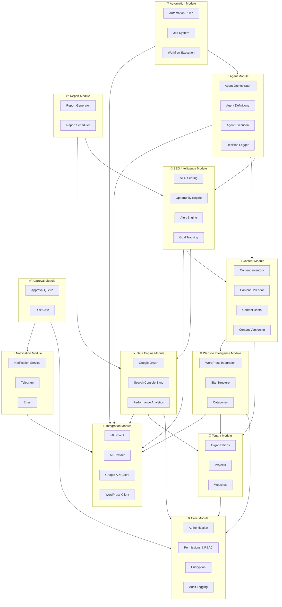
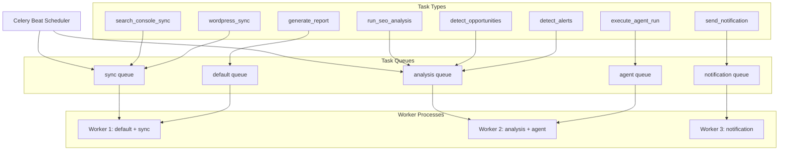

# Module Map — AI SEO OS

## Module Overview

The system is organized into 12 modules, each with clear boundaries and dependencies.



---

## Module Details

### 1. Core Module

**Path**: `app/core/`

**Responsibility**: Security, authentication, authorization, encryption, and audit logging. Every other module depends on this.

| Component | File | Description |
|---|---|---|
| Security | `security.py` | JWT creation/validation, password hashing (bcrypt), token rotation |
| Permissions | `permissions.py` | RBAC decorator, role hierarchy, permission checking |
| Encryption | `encryption.py` | Fernet symmetric encryption for OAuth/WP credentials |
| Exceptions | `exceptions.py` | Application exception hierarchy |
| Utils | `utils.py` | Shared utilities (slug generation, date helpers) |

**Dependencies**: None (leaf module)

**Exposes to other modules**:
- `get_current_user()` dependency
- `require_role()` decorator
- `encrypt_value()` / `decrypt_value()`
- `create_audit_log()`

---

### 2. Tenant Module

**Path**: `app/services/organization_service.py`, `app/services/project_service.py`, `app/services/website_service.py`

**Responsibility**: Multi-tenancy hierarchy — organizations, projects, websites.

| Service | Operations |
|---|---|
| OrganizationService | CRUD orgs, manage members, role assignment, org settings |
| ProjectService | CRUD projects within org |
| WebsiteService | CRUD websites within project, website settings, automation mode |

**Dependencies**: Core (auth, permissions)

**Exposes**:
- `get_org_for_user()` dependency
- `get_website()` with org scoping
- Organization isolation guarantee

---

### 3. Data Engine Module

**Path**: `app/services/google_service.py`, `app/services/search_console_service.py`, `app/services/performance_service.py`, `app/workers/tasks/search_console_tasks.py`

**Responsibility**: Google OAuth, Search Console connection, data sync pipeline, and performance analytics.

| Component | Operations |
|---|---|
| GoogleService | OAuth flow (redirect URL, callback, token exchange, refresh) |
| SearchConsoleService | Property listing, connection CRUD, sync status |
| PerformanceService | Metrics queries, aggregations, comparisons, trend detection |
| SC Sync Task (Celery) | Fetch data from GSC API, validate, normalize, upsert to DB |
| Analysis Task (Celery) | Post-sync: calculate changes, detect drops, generate opportunities |

**Dependencies**: Core, Tenant, Integration (Google API client)

**Data flow**:
```
Celery Beat (schedule)
    → SC Sync Task
        → GoogleClient.fetch_performance()
        → Validate + normalize
        → DB upsert (search_performance_daily)
        → Trigger Analysis Task
            → PerformanceService.calculate_changes()
            → OpportunityService.detect()
            → AlertService.detect()
```

---

### 4. Website Intelligence Module

**Path**: `app/services/wordpress_service.py`, `app/services/category_service.py`, `app/workers/tasks/wordpress_tasks.py`

**Responsibility**: WordPress integration, site structure management, category hierarchy.

| Component | Operations |
|---|---|
| WordPressService | Connection CRUD, content import, draft creation, publishing |
| CategoryService | Category tree CRUD, hierarchy management, materialized path |
| WP Sync Task (Celery) | Import posts, pages, categories from WordPress |

**Dependencies**: Core, Tenant, Integration (WordPress client)

**Data flow**:
```
WordPress Sync Task
    → WPClient.get_posts() / get_pages() / get_categories()
    → Map to content_items + categories
    → Upsert with wp_id deduplication
    → Build/update category tree
    → Calculate content_count per category
```

---

### 5. Content Module

**Path**: `app/services/content_service.py`, `app/services/calendar_service.py`, `app/services/brief_service.py`

**Responsibility**: Content inventory, versioning, calendar, briefs.

| Component | Operations |
|---|---|
| ContentService | CRUD content items, status transitions, search/filter/sort, bulk actions, version creation |
| CalendarService | Calendar views, scheduling, queue management, drag-and-drop reorder |
| BriefService | Brief generation (manual or AI), brief approval |

**Dependencies**: Tenant, Website Intelligence (categories)

**Status machine**:
```
idea → keyword_research → brief_ready → writing → ai_review → seo_review
    → human_review → approved → scheduled → published → monitoring
    → refresh_needed → (loop to writing)
    
Side transitions: any → archived, merged, redirected, deleted
```

---

### 6. SEO Intelligence Module

**Path**: `app/services/seo_scoring_service.py`, `app/services/opportunity_service.py`, `app/services/alert_service.py`

**Responsibility**: Transform raw data into actionable SEO intelligence.

| Component | Operations |
|---|---|
| ScoringService | Calculate SEO scores (page, category, website). Composite score from: content quality, freshness, performance, internal links, keyword coverage |
| OpportunityService | Detect 15 opportunity types from performance data + content inventory. Calculate priority score. Recommend agent. |
| AlertService | Detect anomalies by comparing current vs historical periods. Set severity. Generate AI explanation. |
| GoalService | Track SEO goals, measure progress, generate goal reports |

**Dependencies**: Data Engine (performance data), Content Module (content data)

**Scoring formula**:
```
Page SEO Score = (
    content_quality_score × 0.25
    + freshness_score × 0.15
    + performance_score × 0.25
    + internal_link_score × 0.15
    + keyword_coverage_score × 0.20
)
```

**Opportunity priority formula**:
```
Priority Score = (
    traffic_potential × business_value × ranking_opportunity × confidence
) / effort_estimate
```

---

### 7. Agent Module

**Path**: `app/agents/`, `app/services/agent_orchestrator.py`, `app/workers/tasks/agent_tasks.py`

**Responsibility**: AI agent definitions, orchestration, execution, and decision logging.

| Component | Operations |
|---|---|
| BaseAgent | Abstract base class: input validation, output validation, execution, decision logging |
| AgentOrchestrator | Route tasks to correct agent, manage agent pipelines, handle dependencies between agents |
| Individual Agents | 10 specialized agents (see AI Agent Map) |
| Agent Task (Celery) | Execute agent runs asynchronously |

**Dependencies**: SEO Intelligence, Content Module, Integration (AI provider)

**Agent execution flow**:
```python
# Pseudocode
class BaseAgent:
    def run(self, input: AgentInput) -> AgentOutput:
        # 1. Validate input against schema
        validated = self.input_schema.validate(input)
        
        # 2. Gather context from DB
        context = self.gather_context(validated)
        
        # 3. Call AI provider with structured prompt
        raw_output = self.ai_provider.generate(
            system_prompt=self.system_prompt,
            user_prompt=self.format_prompt(validated, context),
            response_format=self.output_schema
        )
        
        # 4. Validate output against schema
        result = self.output_schema.validate(raw_output)
        
        # 5. Log decisions
        for decision in result.decisions:
            self.log_decision(decision)
        
        # 6. Check risk gates
        for decision in result.decisions:
            if decision.risk > self.auto_approve_threshold:
                self.create_approval_request(decision)
        
        return result
```

---

### 8. Automation Module

**Path**: `app/services/automation_service.py`, `app/workers/tasks/`

**Responsibility**: Automation rules, job lifecycle, workflow execution.

| Component | Operations |
|---|---|
| AutomationService | CRUD rules, trigger evaluation, job creation, status tracking |
| JobRunner | Execute jobs via Celery, manage retries, handle failures |
| WorkflowService | Trigger n8n workflows, track execution, process callbacks |

**Dependencies**: Agent Module, Integration (n8n client)

**Job lifecycle**:
```
pending → queued → running → completed
                          ↘ failed → retrying → running
                                             ↘ failed (max retries) → alert created
```

---

### 9. Approval Module

**Path**: `app/services/approval_service.py`

**Responsibility**: Human-in-the-loop approval queue for high-risk actions.

| Component | Operations |
|---|---|
| ApprovalService | Create requests, list pending, approve/reject, expire stale, notify |

**Dependencies**: Core (auth), Notification Module

**Risk gate logic**:
```python
def should_require_approval(action_type: str, risk: float, website: Website) -> bool:
    # Critical actions always need approval
    if action_type in CRITICAL_ACTIONS:
        return True
    
    # In manual mode, everything needs approval
    if website.automation_mode == 'manual':
        return True
    
    # In AI Assist, medium+ risk needs approval
    if website.automation_mode == 'ai_assist':
        return risk >= 0.5
    
    # In Autopilot, only high risk needs approval
    if website.automation_mode == 'autopilot':
        return risk >= 0.7
    
    return True  # Default: require approval
```

---

### 10. Notification Module

**Path**: `app/services/notification_service.py`, `app/workers/tasks/notification_tasks.py`

**Responsibility**: Multi-channel notification dispatch.

| Component | Operations |
|---|---|
| NotificationService | Create notifications, mark read, query unread count |
| Notification Task (Celery) | Dispatch to channels: dashboard (DB insert), Telegram (bot API), email (SMTP) |

**Dependencies**: Integration (Telegram, email clients)

---

### 11. Report Module

**Path**: `app/services/report_service.py`, `app/workers/tasks/`

**Responsibility**: Generate scheduled and on-demand SEO reports.

| Component | Operations |
|---|---|
| ReportService | Generate daily/weekly/monthly/executive reports. Compile data from all modules. |
| Report Task (Celery) | Scheduled report generation via Celery Beat |

**Dependencies**: Data Engine, SEO Intelligence, Content Module

**Report types**:
- Daily: Quick summary of changes
- Weekly: Performance trends, completed tasks, active opportunities
- Monthly: Full review with comparisons, goal progress
- Executive: High-level summary for management

---

### 12. Integration Module

**Path**: `app/integrations/`

**Responsibility**: External service clients. All external API communication goes through this module.

| Client | Operations |
|---|---|
| `google/oauth.py` | OAuth redirect, callback, token exchange, refresh |
| `google/search_console.py` | Fetch performance data, list properties, manage sites |
| `wordpress/client.py` | GET/POST/PUT posts, pages, categories, media |
| `n8n/client.py` | Trigger webhooks, check execution status |
| `ai/base.py` | Abstract AI provider interface |
| `ai/openai_provider.py` | OpenAI API client |
| `ai/provider_factory.py` | Create provider by config |

**Dependencies**: Core (encryption for credentials)

**All clients share**:
- Connection timeout: 10s
- Read timeout: 30s (120s for AI)
- Retry on 429/5xx with exponential backoff
- Structured error handling
- Request/response logging

---

## Service Layer Architecture

Every API endpoint follows this pattern:

```
API Handler (api/v1/*.py)
    │
    │  Validates request via Pydantic schema
    │  Extracts auth context via dependency injection
    │
    ▼
Service (services/*.py)
    │
    │  Contains business logic
    │  Enforces org isolation
    │  Creates audit logs
    │  Orchestrates operations
    │
    ├──→ Model (models/*.py)
    │     SQLAlchemy queries
    │
    ├──→ Integration (integrations/*.py)
    │     External API calls
    │
    └──→ Worker (workers/tasks/*.py)
          Async background work via Celery
```

Rules:
1. API handlers never contain business logic
2. Services never import from other service's models directly — they call the service
3. Integration clients never access the database
4. Workers can call services but never API handlers
5. Models are data access only — no business rules

---

## Worker Task Architecture



### Queue Separation Rationale

- **sync**: Long-running API calls. Separated so sync delays don't block analysis.
- **analysis**: CPU-intensive scoring and detection. Separated from sync to avoid resource contention.
- **agent**: AI provider calls (slow, expensive). Isolated to control concurrency and cost.
- **notification**: Fast, fire-and-forget. Separated so notification failures don't affect core operations.
- **default**: Everything else (reports, maintenance).

### Celery Beat Schedule (Phase 2+)

| Task | Schedule | Queue |
|---|---|---|
| Search Console sync (per website) | Daily at 06:00 UTC | sync |
| WordPress sync (per website) | Daily at 07:00 UTC | sync |
| SEO analysis (per website) | Daily at 08:00 UTC | analysis |
| Opportunity detection | Daily at 09:00 UTC | analysis |
| Alert detection | Every 6 hours | analysis |
| Weekly report | Monday 08:00 UTC | default |
| Monthly report | 1st of month 08:00 UTC | default |
| Stale approval cleanup | Daily at 00:00 UTC | default |
| Old notification cleanup | Weekly | default |
