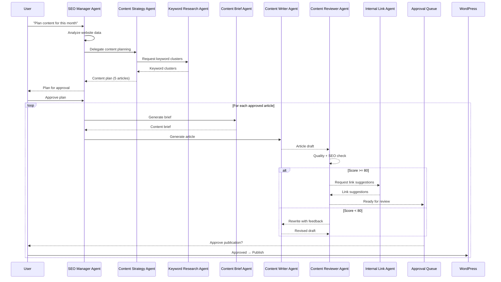
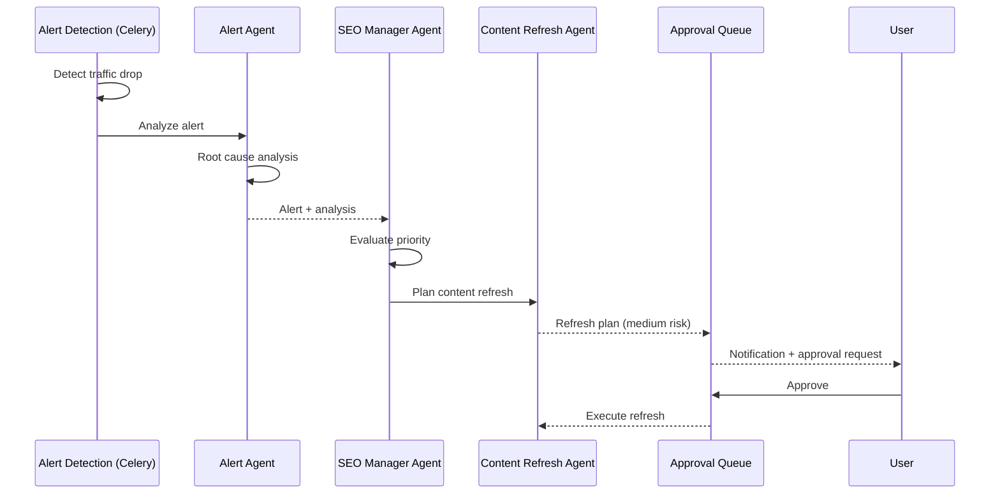

# AI Agent Map — AI SEO OS

## Agent Architecture

### Design Principles

1. **Single responsibility**: Each agent does one thing well.
2. **Structured I/O**: Every agent has a typed input schema and output schema (Pydantic). No free-text chat.
3. **Explainable decisions**: Every action includes `explanation`, `confidence`, `risk`, and `data_used`.
4. **Risk-gated execution**: High-risk decisions create approval requests. Low-risk decisions auto-execute based on `automation_mode`.
5. **Composable pipelines**: The SEO Manager Agent delegates to specialized agents. Agents can chain.
6. **Auditable**: Every agent run and decision is logged to `agent_runs` and `agent_decisions`.

### Agent Execution Framework

```
┌──────────────────────────────────────────────────┐
│                  BaseAgent                        │
│                                                   │
│  1. Validate input (Pydantic input_schema)        │
│  2. Gather context (DB queries)                   │
│  3. Build prompt (system_prompt + context + input) │
│  4. Call AI provider (structured output)           │
│  5. Validate output (Pydantic output_schema)       │
│  6. Log decisions (agent_decisions table)           │
│  7. Check risk gates (approval if needed)           │
│  8. Return result                                   │
└──────────────────────────────────────────────────┘
```

### Base Agent Interface

```python
class BaseAgent(ABC):
    name: str
    agent_type: str
    input_schema: type[BaseModel]     # Pydantic model for input
    output_schema: type[BaseModel]    # Pydantic model for output
    system_prompt: str                # Agent's role and instructions
    allowed_tools: list[str]          # DB queries, API calls it can make
    max_confidence_auto_approve: float  # Below this → needs approval

    @abstractmethod
    async def gather_context(self, input: BaseModel, db: Session) -> dict:
        """Fetch relevant data from DB for the prompt."""
        pass

    @abstractmethod
    def format_prompt(self, input: BaseModel, context: dict) -> str:
        """Build the user prompt from input + context."""
        pass

    async def run(self, input: BaseModel, db: Session) -> BaseModel:
        """Execute the full agent pipeline."""
        # 1-8 as described above
        pass
```

---

## Agent Catalog

### Agent 1: SEO Manager Agent

**Type**: `seo_manager`

**Role**: The central coordinator. Analyzes the overall state of a website and decides what needs to happen. Delegates specific work to other agents.

**When triggered**:
- User requests: "Analyze website and suggest actions"
- Weekly scheduled analysis
- When multiple alerts or opportunities accumulate

**Input schema**:
```json
{
  "website_id": "uuid",
  "scope": "full | quick | specific",
  "focus_areas": ["content", "technical", "opportunities"],
  "date_range": { "from": "2026-01-01", "to": "2026-01-31" },
  "max_actions": 10
}
```

**Context gathered**:
- Website configuration and goals
- Performance summary (current + comparison period)
- Active alerts (by severity)
- Open opportunities (by priority)
- Content inventory status summary
- Recent agent activity
- Pending approvals

**Output schema**:
```json
{
  "summary": "Overall SEO analysis text",
  "health_score": 74,
  "findings": [
    {
      "type": "problem | opportunity | insight",
      "severity": "critical | high | medium | low",
      "title": "Traffic decline on /product-category/",
      "description": "Page lost 35% traffic over 14 days",
      "data": { "before": 520, "after": 340, "pct_change": -34.6 },
      "confidence": 0.92
    }
  ],
  "action_plan": [
    {
      "priority": 1,
      "action": "Refresh content on /product-category/",
      "delegate_to": "content_refresher",
      "reason": "Content is 6 months old, declining traffic",
      "expected_impact": "Recover ~180 clicks/week",
      "risk": "low",
      "confidence": 0.85,
      "requires_approval": false
    },
    {
      "priority": 2,
      "action": "Create article targeting 'بهترین لپتاپ ۲۰۲۶'",
      "delegate_to": "content_strategist",
      "reason": "High-volume keyword with no existing content",
      "expected_impact": "Estimated 300 clicks/month",
      "risk": "low",
      "confidence": 0.78,
      "requires_approval": true
    }
  ],
  "delegations": [
    {
      "agent": "content_refresher",
      "input": { "content_id": "uuid", "reason": "traffic_decline" }
    },
    {
      "agent": "content_strategist",
      "input": { "keyword": "بهترین لپتاپ ۲۰۲۶", "intent": "commercial" }
    }
  ]
}
```

**Risk level**: Low (analysis only — delegated actions go through their own risk gates)

---

### Agent 2: Search Console Analyst Agent

**Type**: `search_analyst`

**Role**: Deep analysis of Search Console data. Finds patterns, anomalies, and insights that simple threshold detection might miss.

**When triggered**:
- By SEO Manager Agent
- By weekly analysis pipeline
- On user request

**Input schema**:
```json
{
  "website_id": "uuid",
  "analysis_type": "full | queries | pages | trends | anomalies",
  "date_range": { "from": "...", "to": "..." },
  "comparison_range": { "from": "...", "to": "..." },
  "filters": {
    "country": "IR",
    "device": null,
    "search_type": "web"
  }
}
```

**Context gathered**:
- Top 100 queries by clicks (current + previous)
- Top 100 pages by clicks (current + previous)
- Queries with biggest position changes
- Pages with biggest traffic changes
- New queries appearing in period
- Lost queries disappearing from period
- CTR distribution by position bucket

**Output schema**:
```json
{
  "summary": "Analysis narrative",
  "metrics": {
    "total_clicks": { "current": 15420, "previous": 13800, "change_pct": 11.74 },
    "total_impressions": { ... },
    "avg_ctr": { ... },
    "avg_position": { ... }
  },
  "growing_queries": [
    { "query": "...", "clicks_change": 120, "position_change": -3.2 }
  ],
  "declining_queries": [...],
  "new_queries": [...],
  "lost_queries": [...],
  "growing_pages": [...],
  "declining_pages": [...],
  "anomalies": [
    {
      "type": "sudden_drop",
      "entity": "/page-url/",
      "description": "...",
      "possible_causes": ["algorithm_update", "content_staleness"],
      "confidence": 0.75
    }
  ],
  "opportunities": [
    {
      "type": "position_4_15",
      "query": "...",
      "current_position": 8.3,
      "impressions": 2400,
      "estimated_ctr_if_top3": 0.08,
      "estimated_additional_clicks": 192,
      "suggested_action": "Optimize title and content for this query"
    }
  ]
}
```

**Risk level**: None (read-only analysis)

---

### Agent 3: Keyword Research Agent

**Type**: `keyword_researcher`

**Role**: Keyword discovery, clustering, and prioritization using existing data and AI analysis.

**When triggered**:
- By Content Strategy Agent
- By user request
- When creating a content brief

**Input schema**:
```json
{
  "website_id": "uuid",
  "mode": "discover | cluster | analyze",
  "seed_keywords": ["لپتاپ گیمینگ", "خرید لپتاپ"],
  "category_id": "uuid",
  "max_clusters": 10,
  "existing_content_ids": ["uuid"]
}
```

**Context gathered**:
- Existing queries from Search Console for this website
- Existing content and their primary keywords
- Category structure

**Output schema**:
```json
{
  "clusters": [
    {
      "cluster_name": "لپتاپ گیمینگ - خرید و بررسی",
      "primary_keyword": "لپتاپ گیمینگ",
      "keywords": [
        { "keyword": "بهترین لپتاپ گیمینگ", "intent": "commercial", "estimated_volume": "high" },
        { "keyword": "لپتاپ گیمینگ ارزان", "intent": "transactional", "estimated_volume": "medium" }
      ],
      "search_intent": "commercial",
      "content_type_suggestion": "comparison",
      "existing_coverage": "partial",
      "existing_content_id": "uuid",
      "priority": "high",
      "competition_assessment": "medium",
      "cannibalization_risk": false
    }
  ],
  "gap_keywords": [
    {
      "keyword": "...",
      "reason": "No existing content targets this keyword",
      "estimated_potential": "medium"
    }
  ]
}
```

**Risk level**: None (analysis only)

---

### Agent 4: Content Strategy Agent

**Type**: `content_strategist`

**Role**: Plans content production strategy. Decides what content to create, update, or merge based on SEO data and business goals.

**When triggered**:
- By SEO Manager Agent
- Weekly automated planning
- User request for content plan

**Input schema**:
```json
{
  "website_id": "uuid",
  "planning_horizon": "weekly | monthly",
  "max_new_content": 10,
  "max_refresh": 5,
  "focus_categories": ["uuid"],
  "business_priorities": ["increase_traffic", "improve_conversions"]
}
```

**Context gathered**:
- All open opportunities
- Content inventory with scores
- Category coverage analysis
- Recent keyword research
- Website content production limits
- Existing content calendar

**Output schema**:
```json
{
  "strategy_summary": "This month, focus on...",
  "new_content_plan": [
    {
      "priority": 1,
      "title_suggestion": "بهترین لپتاپ‌های گیمینگ ۲۰۲۶",
      "target_keyword": "بهترین لپتاپ گیمینگ",
      "content_type": "comparison",
      "search_intent": "commercial",
      "category_id": "uuid",
      "estimated_traffic": 300,
      "reason": "High-volume keyword, no existing content, aligns with business goal",
      "confidence": 0.82,
      "brief_outline": ["Introduction", "Selection criteria", "Top 10 list", "Comparison table", "Conclusion"]
    }
  ],
  "refresh_plan": [
    {
      "content_id": "uuid",
      "current_url": "/laptop-buying-guide/",
      "reason": "Content 8 months old, traffic declining 25%",
      "refresh_scope": "Update statistics, add 2 new sections, improve keyword targeting",
      "estimated_impact": "Recover ~150 clicks/week",
      "priority": 2
    }
  ],
  "merge_suggestions": [
    {
      "content_ids": ["uuid1", "uuid2"],
      "reason": "Cannibalization detected — both target same keyword",
      "suggested_survivor": "uuid1",
      "requires_redirect": true,
      "risk": "medium"
    }
  ]
}
```

**Risk level**: Low (planning only — execution requires separate approval)

---

### Agent 5: Content Brief Agent

**Type**: `content_brief_generator`

**Role**: Creates detailed content briefs for writers (human or AI).

**When triggered**:
- By Content Strategy Agent
- By user request

**Input schema**:
```json
{
  "website_id": "uuid",
  "content_id": "uuid",
  "target_keyword": "بهترین لپتاپ گیمینگ",
  "content_type": "comparison",
  "search_intent": "commercial",
  "category_id": "uuid"
}
```

**Context gathered**:
- Keyword cluster data
- Existing content in same category
- Internal link opportunities
- Competitor content structure (if available)
- Website writing style/brand guidelines

**Output schema**:
```json
{
  "target_keyword": "بهترین لپتاپ گیمینگ",
  "secondary_keywords": ["لپتاپ گیمینگ ارزان", "خرید لپتاپ گیمینگ"],
  "search_intent": "commercial",
  "title_suggestions": [
    "بهترین لپتاپ‌های گیمینگ در سال ۲۰۲۶ — راهنمای خرید کامل",
    "مقایسه ۱۰ لپتاپ گیمینگ برتر ۲۰۲۶"
  ],
  "meta_description_suggestions": ["..."],
  "outline": [
    {
      "heading": "H2: معرفی",
      "notes": "Hook with gaming laptop market growth",
      "target_words": 150
    },
    {
      "heading": "H2: معیارهای انتخاب لپتاپ گیمینگ",
      "notes": "CPU, GPU, RAM, Display, Cooling",
      "target_words": 300
    },
    {
      "heading": "H2: لیست بهترین لپتاپ‌های گیمینگ",
      "sub_headings": [
        "H3: ASUS ROG Strix G16",
        "H3: MSI Raider GE78"
      ],
      "notes": "For each: specs, pros, cons, price range, verdict",
      "target_words": 2000
    },
    {
      "heading": "H2: جدول مقایسه",
      "notes": "Comparison table with key specs",
      "target_words": 100
    },
    {
      "heading": "H2: نتیجه‌گیری و پیشنهاد ما",
      "notes": "Final recommendations by use case",
      "target_words": 200
    }
  ],
  "word_count_target": 3000,
  "tone": "professional_friendly",
  "target_audience": "Gamers looking to buy a laptop, age 18-35",
  "internal_link_targets": [
    { "content_id": "uuid", "anchor_suggestion": "راهنمای خرید لپتاپ" }
  ],
  "notes": "Include price ranges in Toman. Reference local retailers."
}
```

**Risk level**: None (creates a brief, doesn't produce content)

---

### Agent 6: Content Writer Agent

**Type**: `content_writer`

**Role**: Generates full article content from a brief. Follows brand guidelines and SEO targets.

**When triggered**:
- By Content Generation Pipeline (n8n WF-06)
- By Content Strategy Agent
- By user request

**Input schema**:
```json
{
  "content_id": "uuid",
  "brief_id": "uuid",
  "brand_guidelines": "Professional tone, use data and statistics, Persian language",
  "max_tokens": 8000
}
```

**Context gathered**:
- Content brief (full)
- Website writing style
- Existing content to avoid duplication
- Internal link targets

**Output schema**:
```json
{
  "title": "بهترین لپتاپ‌های گیمینگ ۲۰۲۶",
  "meta_title": "بهترین لپتاپ گیمینگ ۲۰۲۶ | مقایسه و بررسی",
  "meta_description": "راهنمای کامل خرید بهترین لپتاپ‌های گیمینگ...",
  "body": "<article>... full HTML content ...</article>",
  "word_count": 3150,
  "keywords_used": {
    "بهترین لپتاپ گیمینگ": 8,
    "لپتاپ گیمینگ ارزان": 3
  },
  "internal_links_inserted": [
    { "target_url": "/laptop-guide/", "anchor": "راهنمای خرید لپتاپ" }
  ],
  "headings_structure": ["H1", "H2", "H2", "H3", "H3", "H2", "H2"],
  "confidence": 0.85,
  "notes": "Used latest pricing data available in training"
}
```

**Risk level**: Medium (generates content that could be published)

**Quality gates**: Output must pass Content Reviewer Agent before any publication.

---

### Agent 7: Content Reviewer Agent

**Type**: `content_reviewer`

**Role**: Reviews AI-generated or human-written content for quality, SEO compliance, and accuracy.

**When triggered**:
- Automatically after Content Writer Agent
- Before any content publication
- On user request

**Input schema**:
```json
{
  "content_id": "uuid",
  "version_id": "uuid",
  "review_types": ["quality", "seo", "structure", "readability", "duplicate"]
}
```

**Context gathered**:
- Content version body
- Content brief (if exists)
- Target keywords
- Existing content (for duplicate detection)
- Website SEO guidelines

**Output schema**:
```json
{
  "overall_score": 82,
  "pass": true,
  "reviews": {
    "quality": {
      "score": 85,
      "issues": [],
      "suggestions": ["Add more specific data points in section 3"]
    },
    "seo": {
      "score": 78,
      "issues": [
        {
          "severity": "medium",
          "issue": "Primary keyword missing from first paragraph",
          "suggestion": "Add 'بهترین لپتاپ گیمینگ' to opening paragraph"
        }
      ],
      "keyword_density": { "بهترین لپتاپ گیمینگ": 0.3 },
      "meta_title_length": 52,
      "meta_description_length": 148
    },
    "structure": {
      "score": 90,
      "heading_hierarchy": "valid",
      "word_count": 3150,
      "paragraph_avg_length": 85
    },
    "readability": {
      "score": 80,
      "issues": ["Some sentences exceed 30 words"]
    },
    "duplicate": {
      "score": 95,
      "similar_content": [],
      "cannibalization_risk": false
    }
  },
  "verdict": "approve_with_suggestions",
  "blocking_issues": [],
  "suggestions": [
    "Add primary keyword to first paragraph",
    "Include more specific data points"
  ]
}
```

**Risk level**: None (review only)

**Decision**: If `overall_score < 60`, the content goes back to the writer agent for rewrite. If `60-80`, suggestions are applied. If `>80`, the content proceeds.

---

### Agent 8: Internal Link Agent

**Type**: `internal_linker`

**Role**: Discovers internal linking opportunities and suggests anchor text.

**When triggered**:
- After new content creation
- After content refresh
- Weekly link analysis
- By SEO Manager Agent

**Input schema**:
```json
{
  "website_id": "uuid",
  "mode": "analyze_all | for_content | find_orphans",
  "content_id": "uuid",
  "max_suggestions": 20
}
```

**Context gathered**:
- All content items with URLs
- Existing internal links
- Content keyword mapping
- Category relationships

**Output schema**:
```json
{
  "suggestions": [
    {
      "source_content_id": "uuid",
      "source_url": "/laptop-gaming-guide/",
      "target_content_id": "uuid",
      "target_url": "/best-gaming-laptops/",
      "suggested_anchor": "بهترین لپتاپ‌های گیمینگ",
      "context": "This link fits naturally in paragraph 3 where gaming laptops are mentioned",
      "relevance_score": 0.92,
      "confidence": 0.88
    }
  ],
  "orphan_pages": [
    {
      "content_id": "uuid",
      "url": "/old-review/",
      "incoming_links": 0,
      "suggestion": "Add link from category page or related article"
    }
  ],
  "over_linked_pages": [
    {
      "url": "/homepage/",
      "outgoing_links": 45,
      "suggestion": "Consider reducing non-essential links"
    }
  ],
  "link_stats": {
    "total_pages": 120,
    "pages_with_outgoing": 95,
    "orphan_pages": 12,
    "avg_internal_links_per_page": 5.3
  }
}
```

**Risk level**: Low for suggestions. Medium if auto-inserting links (requires approval in AI Assist mode).

---

### Agent 9: Content Refresh Agent

**Type**: `content_refresher`

**Role**: Identifies what to change in existing content to improve its performance.

**When triggered**:
- By SEO Manager Agent (when content decay detected)
- By Opportunity Engine
- By user request

**Input schema**:
```json
{
  "content_id": "uuid",
  "reason": "traffic_decline | outdated | low_score | manual",
  "performance_data": {
    "clicks_before": 520,
    "clicks_after": 340,
    "position_before": 4.2,
    "position_after": 7.8
  }
}
```

**Context gathered**:
- Current content version
- Performance history (90 days)
- Queries ranking for this page
- Competing content (by queries)
- Content brief (if exists)

**Output schema**:
```json
{
  "diagnosis": "Content is 8 months old. Statistics are outdated. Missing coverage of 3 new products in market.",
  "refresh_scope": "major",
  "changes": [
    {
      "type": "update_section",
      "section": "Product list",
      "current_summary": "Lists 7 products from early 2025",
      "proposed_change": "Add 3 new 2026 products, remove 2 discontinued",
      "reason": "Market has changed, content is outdated"
    },
    {
      "type": "add_section",
      "after_section": "Comparison table",
      "proposed_heading": "FAQ - سوالات متداول",
      "reason": "Target FAQ rich snippets for 3 high-volume questions"
    },
    {
      "type": "update_meta",
      "field": "meta_title",
      "current": "بهترین لپتاپ‌های گیمینگ ۲۰۲۵",
      "proposed": "بهترین لپتاپ‌های گیمینگ ۲۰۲۶ | مقایسه و بررسی",
      "reason": "Update year, add action words"
    }
  ],
  "estimated_impact": "Recover ~180 clicks/week, potential to improve position by 2-3 spots",
  "confidence": 0.82,
  "risk": "medium",
  "requires_full_rewrite": false
}
```

**Risk level**: Medium (modifies existing published content — always requires approval unless minor metadata changes)

---

### Agent 10: Alert Agent

**Type**: `alert_agent`

**Role**: Analyzes detected anomalies and provides root cause analysis.

**When triggered**:
- Automatically after alert creation (high/critical severity)
- By SEO Manager Agent

**Input schema**:
```json
{
  "alert_id": "uuid",
  "alert_type": "traffic_drop",
  "website_id": "uuid"
}
```

**Context gathered**:
- Alert details
- Page/query performance history (90 days)
- Related pages in same category
- Recent changes to the website
- Other concurrent alerts

**Output schema**:
```json
{
  "root_cause_analysis": "The traffic drop correlates with a position decline from 4.2 to 7.8 for the primary keyword. No content changes were made. Possible external cause: competitor published comprehensive guide on same topic.",
  "possible_causes": [
    { "cause": "competitor_content", "probability": 0.6 },
    { "cause": "algorithm_update", "probability": 0.25 },
    { "cause": "content_staleness", "probability": 0.15 }
  ],
  "recommended_actions": [
    {
      "action": "Refresh content with updated data and expanded sections",
      "delegate_to": "content_refresher",
      "priority": "high",
      "estimated_impact": "medium"
    }
  ],
  "related_alerts": ["uuid1", "uuid2"],
  "confidence": 0.72
}
```

**Risk level**: None (analysis only)

---

### Agent 11: Report Agent

**Type**: `report_agent`

**Role**: Generates human-readable SEO reports and executive summaries.

**When triggered**:
- Weekly/monthly schedule
- By SEO Manager Agent
- By user request

**Input schema**:
```json
{
  "website_id": "uuid",
  "report_type": "daily | weekly | monthly | executive",
  "date_range": { "from": "...", "to": "..." }
}
```

**Output schema**:
```json
{
  "title": "Weekly SEO Report — example.com — Jan 1-7, 2026",
  "executive_summary": "Organic performance improved 12% week-over-week...",
  "sections": [
    {
      "title": "Performance Overview",
      "content": "...",
      "charts": [{ "type": "line", "data": [...] }]
    },
    {
      "title": "Key Wins",
      "content": "..."
    },
    {
      "title": "Issues Requiring Attention",
      "content": "..."
    },
    {
      "title": "Completed Actions",
      "content": "..."
    },
    {
      "title": "Next Week Plan",
      "content": "..."
    }
  ]
}
```

**Risk level**: None

---

## Agent Pipeline Diagrams

### Full Content Production Pipeline



### Alert Response Pipeline



---

## Agent Summary Table

| # | Agent | Type | Risk | Auto-Approve | Triggers |
|---|---|---|---|---|---|
| 1 | SEO Manager | `seo_manager` | Low | Yes | User, schedule |
| 2 | Search Analyst | `search_analyst` | None | Yes | Manager, schedule |
| 3 | Keyword Research | `keyword_researcher` | None | Yes | Strategist, user |
| 4 | Content Strategy | `content_strategist` | Low | Yes | Manager, schedule |
| 5 | Content Brief | `content_brief_generator` | None | Yes | Strategist, user |
| 6 | Content Writer | `content_writer` | Medium | No (needs review) | Pipeline, user |
| 7 | Content Reviewer | `content_reviewer` | None | Yes | After writer |
| 8 | Internal Linker | `internal_linker` | Low-Med | Suggestions: Yes, Insertion: No | Manager, schedule |
| 9 | Content Refresh | `content_refresher` | Medium | No (needs approval) | Manager, alerts |
| 10 | Alert Agent | `alert_agent` | None | Yes | Alert detection |
| 11 | Report Agent | `report_agent` | None | Yes | Schedule, user |

---

## Agent Configuration (Database Seed)

When the system initializes, these agents are seeded into the `ai_agents` table:

```json
[
  {
    "name": "SEO Manager",
    "agent_type": "seo_manager",
    "description": "Central AI coordinator. Analyzes website state and delegates to specialized agents.",
    "allowed_tools": ["read_performance", "read_content", "read_alerts", "read_opportunities", "delegate_agent"],
    "restricted_tools": ["write_wordpress", "delete_content"],
    "max_confidence_auto_approve": 0.9
  },
  {
    "name": "Search Console Analyst",
    "agent_type": "search_analyst",
    "description": "Deep analysis of Search Console performance data.",
    "allowed_tools": ["read_performance", "read_queries", "read_pages"],
    "restricted_tools": ["write_any"],
    "max_confidence_auto_approve": 1.0
  },
  {
    "name": "Content Writer",
    "agent_type": "content_writer",
    "description": "Generates article content from briefs.",
    "allowed_tools": ["read_brief", "read_content", "write_content_version"],
    "restricted_tools": ["publish_wordpress", "delete_content"],
    "max_confidence_auto_approve": 0.0
  }
]
```

**Note**: `max_confidence_auto_approve = 0.0` means this agent's output NEVER auto-approves — it always goes through the review pipeline (Content Reviewer Agent, then human approval for publication).

---

## Future Agents (Phase 9+)

| Agent | Purpose | Phase |
|---|---|---|
| Technical SEO Agent | Analyze crawl data, site speed, structured data | 9 |
| Competitor Analysis Agent | Monitor competitor content and rankings | 9 |
| Cannibalization Agent | Detect and resolve keyword cannibalization | 9 |
| SEO Learning Agent | Analyze which actions led to improvements | 10 |
| Content Gap Agent | Comprehensive topical gap analysis | 9 |
