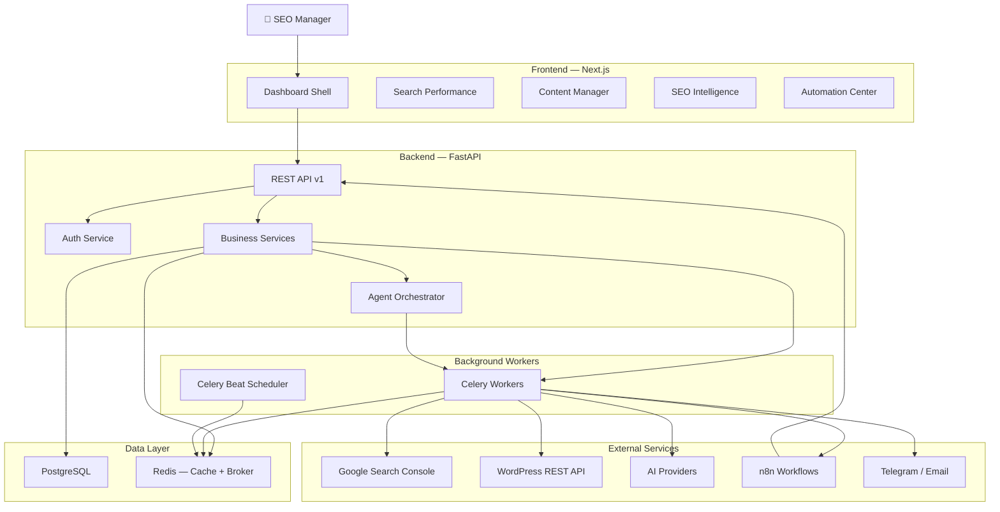
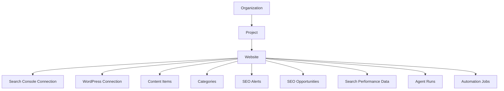
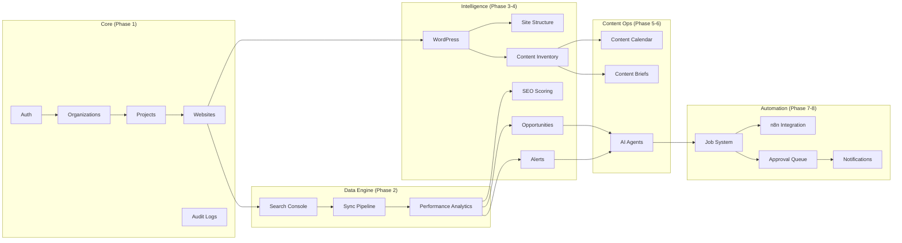
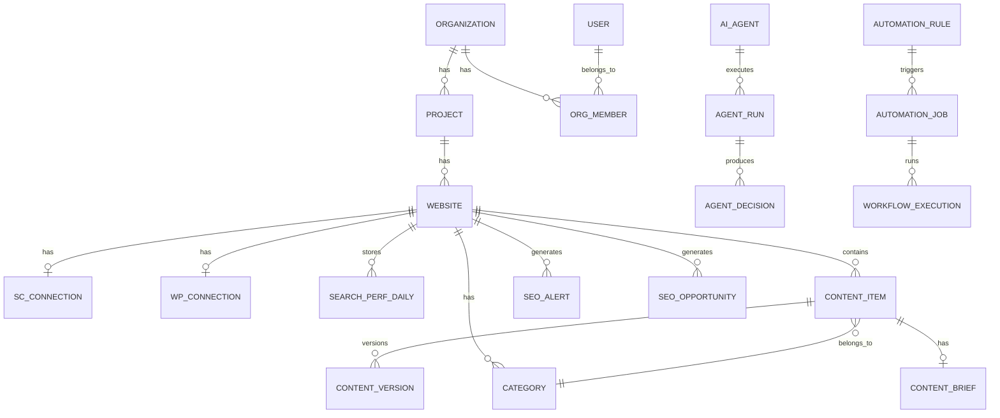
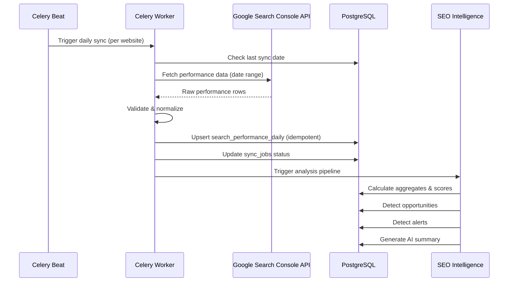
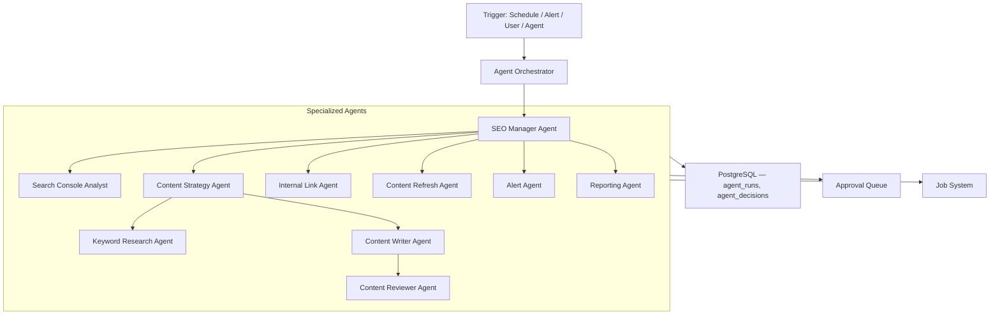

# Phase 0 — AI SEO OS Architecture & Planning

## Project Summary

An AI-powered SEO Operating System — a centralized platform where an SEO manager connects multiple websites and supervises AI Agents that handle the repetitive 70–90% of SEO operations: data collection, analysis, content planning, content generation, publishing, and monitoring.

The user's role is supervisory: review dashboards, approve high-risk changes, set goals, and let automation execute.

---

## System Architecture



---

## Technology Stack

| Layer | Choice | Rationale |
|---|---|---|
| **Frontend** | Next.js 15 + TypeScript + App Router | Server components, file-based routing, SSR for dashboard performance |
| **CSS** | Tailwind CSS v4 | User spec requires it; rapid UI development for data-heavy dashboards |
| **Components** | shadcn/ui | Accessible, composable, Tailwind-native, no runtime dependency |
| **Charts** | Recharts | Lightweight, React-native, sufficient for SEO metric charts |
| **Data Tables** | TanStack Table | Headless, supports filtering/sorting/pagination/column visibility |
| **Server State** | TanStack Query (React Query) | Caching, background refetch, optimistic updates |
| **Backend** | Python 3.12 + FastAPI | Async, auto-generated OpenAPI docs, Pydantic validation |
| **ORM** | SQLAlchemy 2.0 + Alembic | Mature, typed models, reliable migrations |
| **Database** | PostgreSQL 16 | JSONB for flexible metadata, partitioning for performance data |
| **Cache / Broker** | Redis 7 | Message broker for Celery + response caching + session store |
| **Workers** | Celery 5 | Most mature Python task queue; beat scheduler for cron jobs, retry policies, result backend, broad community support. Dramatiq is leaner but Celery's ecosystem (monitoring via Flower, beat scheduling, broad integration patterns) wins for a platform this complex |
| **Automation** | n8n (self-hosted) | Visual workflow builder for non-developer-friendly integrations; webhook-triggered by backend, reports status back via API callback |
| **Auth** | JWT access + refresh tokens | Stateless API auth; refresh tokens in DB for revocation |
| **Infra** | Docker + Docker Compose | One command dev environment; separate containers per service |

---

## Multi-Tenancy Hierarchy



Every query is scoped to `organization_id`. Cross-org data leakage is architecturally impossible — the service layer enforces org isolation before any DB call.

---

## Module Map & Dependencies



---

## Key Architecture Decisions

### 1. Celery as the single worker system — n8n is integration-only

All SEO analysis, scoring, sync pipelines, and agent orchestration run as **Celery tasks** inside the Python backend. n8n handles only external-facing integrations (Google OAuth callbacks, WordPress publishing, notification dispatch) and is triggered via webhooks from the backend.

This keeps business logic testable, typed, and version-controlled. n8n workflows are stateless connectors.

### 2. Search Console data is stored historically

The `search_performance_daily` table stores every data point from every sync. Dashboard queries hit PostgreSQL, not the GSC API. This gives us: unlimited historical retention, sub-second dashboard loads, comparison periods, and the ability to run offline SEO analysis.

### 3. Agent outputs are structured JSON — not chat

Every AI Agent produces a validated Pydantic schema as output. The `agent_decisions` table stores the decision, its explanation, confidence score, risk score, and the data that was used. No unstructured chat text anywhere in the agent pipeline.

### 4. Approval gates are risk-based

Actions below a risk threshold execute automatically (in AI Assist / Autopilot modes). Actions above the threshold create an `approval_request` and block until a human decides. The threshold is configurable per website.

### 5. Soft-delete and audit everywhere

Every entity that matters has `deleted_at` (soft-delete) and every mutation writes to `audit_logs`. The user can always answer "what happened and why."

---

## Database Design

> [!IMPORTANT]
> Full ERD with all tables, columns, types, constraints, and indexes is in [database-design.md](file:///c:/Users/Administrator/Desktop/SEO/docs/architecture/database-design.md).

### Entity Count by Phase

| Phase | Tables | Description |
|---|---|---|
| 1 — Foundation | 7 | users, organizations, org_members, projects, websites, refresh_tokens, audit_logs |
| 2 — Search Console | 4 | google_accounts, sc_properties, sc_connections, search_performance_daily, sync_jobs |
| 3 — Website Intel | 5 | wordpress_connections, categories, content_items, content_versions, content_keywords |
| 4 — SEO Intelligence | 4 | seo_scores, seo_opportunities, seo_alerts, seo_goals |
| 5 — Content Ops | 2 | content_briefs, internal_links |
| 6 — AI Agents | 3 | ai_agents, agent_runs, agent_decisions |
| 7 — Automation | 5 | automation_rules, automation_jobs, workflow_executions, approval_requests, notifications |
| **Total** | **30** | |

### Key Relationships



---

## API Design

> [!IMPORTANT]
> Full API endpoint map with methods, query parameters, and request/response schemas is in [api-design.md](file:///c:/Users/Administrator/Desktop/SEO/docs/architecture/api-design.md).

### Endpoint Groups

```
/api/v1/auth              — Login, register, refresh, password reset
/api/v1/users             — Profile, preferences
/api/v1/organizations     — CRUD, members, roles
/api/v1/projects          — CRUD within org
/api/v1/websites          — CRUD within project
/api/v1/google            — OAuth flow, account management
/api/v1/search-console    — Connection, sync, properties
/api/v1/performance       — Metrics, charts, comparisons
/api/v1/queries           — Query explorer with filters
/api/v1/pages             — Page explorer with filters
/api/v1/wordpress         — Connection, sync, content import
/api/v1/categories        — Category hierarchy CRUD
/api/v1/content           — Content inventory CRUD, versions
/api/v1/content-calendar  — Calendar, queue, scheduling
/api/v1/content-briefs    — Brief generation, approval
/api/v1/opportunities     — Opportunity list, actions
/api/v1/alerts            — Alert management, resolution
/api/v1/seo-scores        — Score queries
/api/v1/agents            — Agent config, runs, decisions
/api/v1/automation        — Rules, jobs, workflow status
/api/v1/approvals         — Approval queue, actions
/api/v1/notifications     — User notifications
/api/v1/reports           — Report generation, history
/api/v1/settings          — Org/website settings
/api/v1/audit-logs        — Audit log queries
```

### Standard Patterns

Every list endpoint supports: `page`, `page_size`, `sort_by`, `sort_dir`, `search`, date range filters, and entity-specific filters. Responses follow:

```json
{
  "data": [...],
  "meta": {
    "total": 1250,
    "page": 1,
    "page_size": 25,
    "total_pages": 50
  }
}
```

Errors follow RFC 7807:

```json
{
  "type": "validation_error",
  "title": "Validation Error",
  "status": 422,
  "detail": "...",
  "errors": [...]
}
```

---

## Permission Matrix

| Role | Org | Projects | Websites | Content | Agents | Automation | Approvals | Settings |
|---|---|---|---|---|---|---|---|---|
| **Owner** | Full | Full | Full | Full | Full | Full | Full | Full |
| **Admin** | Read | Full | Full | Full | Full | Full | Full | Full |
| **SEO Manager** | Read | Read | Full | Full | Full | Manage | Approve | Website only |
| **Editor** | Read | Read | Read | Edit own | Read | Read | — | — |
| **Reviewer** | Read | Read | Read | Review | Read | Read | Review only | — |
| **Viewer** | Read | Read | Read | Read | Read | Read | — | — |

---

## Search Console Sync Pipeline



**Idempotency**: The composite unique key `(website_id, date, query, page, country, device, search_type)` ensures re-running a sync for the same date range is safe — it upserts, never duplicates.

**Rate limiting**: GSC API quota is 1200 queries/minute. The worker respects this with exponential backoff and batches requests by date (one API call per day per dimension combination).

---

## AI Agent Architecture



Each agent:
- Receives a typed **input schema** (Pydantic model)
- Produces a typed **output schema** (Pydantic model)
- Logs every decision to `agent_decisions` with explanation, confidence, risk
- Cannot bypass the approval gate for high-risk actions
- Has an explicit list of allowed and restricted tools

The **SEO Manager Agent** is the orchestrator that reads platform data, prioritizes work, and delegates to specialized agents. It does not perform low-level work itself.

---

## n8n Integration Design

n8n is called by the backend, not the reverse. The flow:

```
Backend creates automation_job → 
  Celery worker calls n8n webhook → 
    n8n executes workflow → 
      n8n calls backend callback API with result → 
        Backend updates job status + stores result
```

n8n workflows are version-controlled as JSON exports in `/n8n/workflows/`. The backend stores `n8n_workflow_id` and `n8n_execution_id` for traceability.

n8n **never** writes directly to PostgreSQL. It always goes through the backend API.

---

## Automation Risk Matrix

| Action | Risk | Approval Required | Autopilot Allowed |
|---|---|---|---|
| Content idea generation | Low | No | ✅ |
| Keyword clustering | Low | No | ✅ |
| Content brief generation | Low | No | ✅ |
| Article draft (not published) | Low | No | ✅ |
| Meta title/description suggestion | Low | No | ✅ |
| Content calendar generation | Low | No | ✅ |
| SEO report generation | Low | No | ✅ |
| Alert creation | Low | No | ✅ |
| Internal link suggestion | Low | No | ✅ |
| WordPress draft creation | Medium | AI Assist: Yes | ✅ |
| Content update (minor) | Medium | AI Assist: Yes | ✅ |
| Publishing new content | Medium | Yes | No |
| Updating existing published content | High | Yes | No |
| URL change / redirect | High | Yes | No |
| Canonical change | High | Yes | No |
| Content merge | High | Yes | No |
| Content deletion | Critical | Yes | No |
| Bulk internal linking | High | Yes | No |
| Website structure change | Critical | Yes | No |

---

## Development Phases — Timeline Estimate

| Phase | Name | Estimated Duration | Depends On |
|---|---|---|---|
| 0 | Architecture & Planning | **This document** | — |
| 1 | Foundation Platform | ~2 weeks | Phase 0 approval |
| 2 | Search Console Data Engine | ~2 weeks | Phase 1 |
| 3 | Website Intelligence | ~2 weeks | Phase 1 |
| 4 | SEO Intelligence Engine | ~1.5 weeks | Phase 2 + 3 |
| 5 | Content Management | ~1.5 weeks | Phase 3 |
| 6 | AI Content Agents | ~2 weeks | Phase 4 + 5 |
| 7 | n8n Automation Engine | ~1.5 weeks | Phase 1 |
| 8 | AI SEO Manager | ~2 weeks | Phase 6 + 7 |
| 9 | Advanced SEO Automation | ~2 weeks | Phase 8 |
| 10 | Multi-Site SaaS | ~1.5 weeks | Phase 9 |
| 11 | Production Hardening | ~2 weeks | Phase 10 |

> [!NOTE]
> Phases 2 and 3 can run in parallel. Phase 7 (n8n) can start alongside Phase 5.

---

## MVP Scope (Phases 1–4)

The minimum usable product includes:

1. ✅ User auth (register, login, JWT)
2. ✅ Organization + project + website management
3. ✅ Role-based access control
4. ✅ Google OAuth + Search Console connection
5. ✅ Automated daily Search Console sync
6. ✅ Search Performance dashboard (clicks, impressions, CTR, position)
7. ✅ Query Explorer with filters, sorting, comparisons
8. ✅ Page Explorer with filters, sorting, comparisons
9. ✅ WordPress connection + content import
10. ✅ Content inventory table
11. ✅ Website category structure
12. ✅ SEO scoring (page, category, website)
13. ✅ SEO opportunity detection
14. ✅ SEO alert detection
15. ✅ AI executive summary on dashboard

**Not in MVP** (deferred to later phases): content calendar, AI content generation, n8n workflows, agent system, approval queue, notifications, multi-site portfolio, reporting.

---

## Project File Structure

> [!IMPORTANT]
> Full directory structure is in [folder-structure.md](file:///c:/Users/Administrator/Desktop/SEO/docs/architecture/folder-structure.md).

```
SEO/
├── docker-compose.yml
├── docker-compose.prod.yml
├── .env.example
├── README.md
├── docs/
│   └── architecture/
├── backend/
│   ├── Dockerfile
│   ├── pyproject.toml
│   ├── alembic.ini
│   ├── alembic/
│   └── app/
│       ├── main.py              # FastAPI app entry
│       ├── config.py            # Env-based settings
│       ├── database.py          # SQLAlchemy engine + session
│       ├── dependencies.py      # DI for auth, DB session, org scoping
│       ├── models/              # SQLAlchemy models
│       ├── schemas/             # Pydantic request/response schemas
│       ├── api/v1/              # Route handlers
│       ├── services/            # Business logic
│       ├── workers/             # Celery app + tasks
│       ├── integrations/        # Google, WordPress, n8n, AI clients
│       ├── agents/              # Agent definitions + orchestrator
│       └── core/                # Security, permissions, exceptions, utils
├── frontend/
│   ├── Dockerfile
│   ├── package.json
│   └── src/
│       ├── app/                 # Next.js App Router pages
│       ├── components/          # UI + layout + charts + data tables
│       ├── lib/                 # API client, auth, utils
│       ├── hooks/               # React hooks
│       ├── stores/              # Client state (Zustand if needed)
│       └── types/               # TypeScript types
├── n8n/
│   ├── Dockerfile
│   └── workflows/               # Exported workflow JSONs
└── docker/
    ├── nginx/
    ├── postgres/
    └── redis/
```

---

## Docker Compose Services

| Service | Image | Port | Purpose |
|---|---|---|---|
| `frontend` | Node 20 + Next.js | 3000 | Dashboard |
| `backend` | Python 3.12 + FastAPI | 8000 | API |
| `worker` | Same as backend | — | Celery worker |
| `beat` | Same as backend | — | Celery beat scheduler |
| `postgres` | PostgreSQL 16 | 5432 | Primary database |
| `redis` | Redis 7 | 6379 | Cache + message broker |
| `n8n` | n8n latest | 5678 | Workflow automation |
| `flower` | Flower (dev only) | 5555 | Celery monitoring |

---

## Security Checklist

- [x] JWT access tokens (short-lived, 15 min)
- [x] Refresh tokens in DB (revocable, 7-day expiry)
- [x] Password hashing with bcrypt
- [x] Organization isolation on every query
- [x] RBAC on every endpoint
- [x] OAuth tokens encrypted at rest (Fernet symmetric encryption)
- [x] WordPress credentials encrypted at rest
- [x] CORS restricted to frontend origin
- [x] Rate limiting on auth endpoints
- [x] Input validation via Pydantic on every request
- [x] Soft-delete (no hard deletes of business data)
- [x] Audit log for every mutation
- [x] No secrets in code — all via `.env`

---

## Key Assumptions

1. **Single admin user initially** — multi-user org management is built but the first deployment is single-org, single-user. The multi-tenant architecture is ready for SaaS scaling.
2. **AI provider is configurable** — the agent system is provider-agnostic (OpenAI, Anthropic, Google, local). Initial implementation uses a single configurable provider.
3. **Persian language support** — the UI will support RTL layouts and Persian localization. Search Console data is stored as-is (queries in any language).
4. **n8n is self-hosted** — runs as a Docker container alongside the backend. No cloud n8n dependency.
5. **Google Search Console API limitations** — the API provides up to 16 months of historical data. The system stores everything it fetches, building a longer history over time.

---

## Open Questions

> [!IMPORTANT]
> **Q1: AI Provider** — Which AI provider should be the default for agents? Options: OpenAI (GPT-4o), Anthropic (Claude), Google (Gemini), or make it provider-agnostic from day one? This affects content generation quality and cost.

> [!IMPORTANT]
> **Q2: Language** — Should the dashboard UI be in Persian (RTL) or English? Or bilingual with a language switcher? This affects Phase 1 frontend work.

> [!WARNING]
> **Q3: Google OAuth credentials** — You'll need a Google Cloud project with Search Console API enabled and OAuth consent screen configured. Do you already have this, or should I document the setup steps?

> [!NOTE]
> **Q4: Deployment target** — Is this running on a single VPS (e.g., Hetzner, DigitalOcean) or a cloud platform (AWS, GCP)? This affects the production Docker Compose configuration.

---

## Proposed Changes

### Phase 1 — Foundation (first implementation phase after approval)

#### [NEW] Docker & Infrastructure
- `docker-compose.yml` — All 8 services
- `.env.example` — All environment variables
- `backend/Dockerfile`, `frontend/Dockerfile`

#### [NEW] Backend Foundation
- FastAPI app with versioned routing
- SQLAlchemy models for core entities (7 tables)
- Alembic migrations
- JWT auth with refresh tokens
- Organization/project/website CRUD
- RBAC middleware
- Audit logging

#### [NEW] Frontend Foundation
- Next.js App Router with TypeScript
- Tailwind + shadcn/ui setup
- Auth pages (login, register)
- Dashboard shell (sidebar, header, org/website selector)
- Settings pages (org, users, websites)

---

## Verification Plan

### Phase 0 Verification
- Architecture documents reviewed and approved by user
- No contradictions between spec and implementation plan
- Database design covers all entities from spec
- API design covers all modules

### Phase 1 Verification
- Docker Compose starts all services with one command
- User can register, login, create org, add website
- RBAC prevents unauthorized access
- Alembic migrations run cleanly
- API docs accessible at `/docs`
